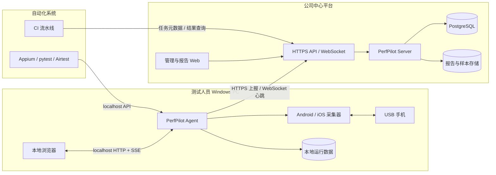
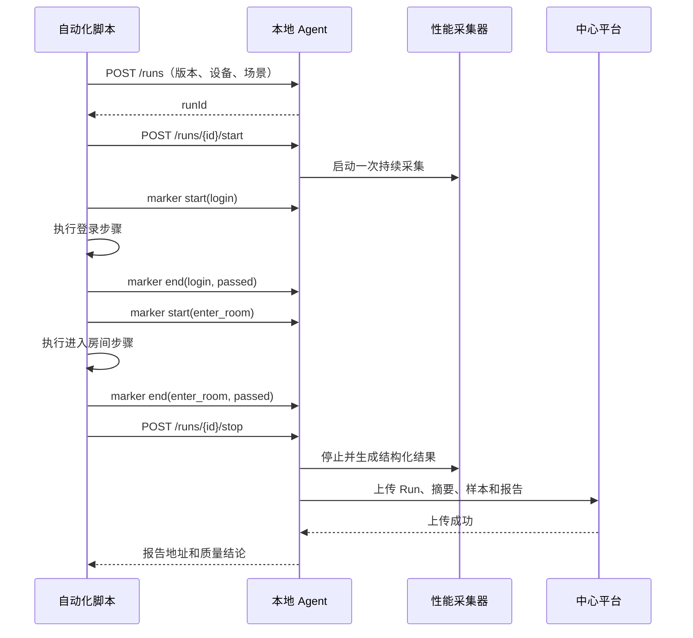

# PerfPilot 最终架构设计

> 本文档描述 PerfPilot 面向公司内部推广后的目标架构，覆盖员工本地性能测试、中心后台使用情况统计、App 版本管理、版本报告对比，以及与自动化测试平台联动。
>
> 设计原则：手机始终连接测试人员自己的 PC；性能采集在本地执行；中心平台负责身份、任务元数据、结果汇总、报告查询和版本对比，不直接访问 USB 设备。

---

## 1. 建设目标

PerfPilot 最终需要支持三种使用方式：

1. 测试人员安装客户端，连接手机后通过本地 Web 页面手动执行性能测试。
2. 管理人员在中心后台查看客户端在线情况、测试次数、成功率、设备分布和测试报告。
3. 自动化平台在执行 Appium、pytest、Airtest 等测试时，通过本地 Agent API 同步启动性能监测，并按功能模块生成报告。

最终用户不需要安装 Python、配置虚拟环境或接触项目源码。Windows 首期发布为安装包：

```text
PerfPilot-Setup-x64.exe
```

安装后的操作流程：

```text
安装客户端 -> 连接手机 -> 双击 PerfPilot -> 浏览器自动打开 -> 选择 App -> 开始测试
```

## 2. 总体架构



### 2.1 本地数据链路

```text
手机 -> ADB/pymobiledevice3 -> 采集器 -> Agent -> 本地网页
```

这条链路不能依赖中心服务器。公司网络暂时中断时，正在执行的测试应继续完成，并将结果放入待上传队列。

### 2.2 中心管理链路

```text
Agent -> 公司 HTTPS API -> 数据库/对象存储 -> 管理后台
```

中心平台只接收定义好的结构化数据和报告文件，不允许下发任意 Shell 命令。

## 3. 系统组件

### 3.1 PerfPilot Desktop

员工安装的 Windows 客户端，包含：

- 桌面启动器：启动本地 Agent 并自动打开浏览器。
- 本地 Web 控制台：沿用当前设备选择、实时监控和报告页面。
- 本地 Agent：设备发现、会话管理、自动化 API、离线上传队列。
- Android 采集器：封装 ADB、FPS、CPU、PSS 和 Jank 采集。
- iOS 采集器：封装 `pymobiledevice3`、FPS、CPU、Memory 和 GPU 采集。
- 本地数据目录：保存结构化样本、HTML 报告和上传状态。
- 自动更新器：检查并安装公司签名的客户端版本。

建议安装目录和数据目录分开：

```text
C:\Program Files\PerfPilot\          # 只读程序文件
%LOCALAPPDATA%\PerfPilot\            # 配置、日志和临时数据
%LOCALAPPDATA%\PerfPilot\runs\       # 测试运行数据
%LOCALAPPDATA%\PerfPilot\upload\     # 待上传队列
```

客户端只监听回环地址：

```text
http://127.0.0.1:8765
```

不开放局域网端口，避免其他电脑控制本机连接的手机。

### 3.2 PerfPilot Server

公司服务器上的中心服务，职责包括：

- 公司账号登录与权限管理。
- Agent 注册、版本检查、心跳和在线状态。
- App、版本、构建和测试场景管理。
- Run 元数据和指标摘要接收。
- 样本文件、HTML 报告和附件存储。
- 版本对比和性能回归判断。
- 使用统计和审计日志。
- 自动化流水线结果查询和质量门禁。

建议技术栈：

```text
后端：FastAPI
关系数据库：PostgreSQL
报告/样本：MinIO 或公司对象存储
缓存与任务队列：Redis（规模扩大后引入）
前端：复用现有 Web UI，增加管理和版本对比页面
入口：Nginx / 公司 API Gateway，统一 HTTPS
```

小规模试运行可以先使用 SQLite 和本地文件目录，但正式多人环境建议直接使用 PostgreSQL 和对象存储。

### 3.3 管理后台

后台至少提供以下页面：

| 页面       | 主要内容                                           |
| ---------- | -------------------------------------------------- |
| 总览       | 今日测试数、成功率、活跃用户、活跃 Agent、平台分布 |
| 客户端     | 用户、计算机、Agent 版本、在线状态、最后心跳       |
| 测试记录   | App、版本、设备、场景、执行人、时间、状态          |
| 报告详情   | 指标摘要、趋势、模块切片、原始报告下载             |
| 版本对比   | 基线版本与候选版本的指标差值和回归结论             |
| 自动化任务 | 流水线、用例、模块、关联 Run 和执行状态            |
| 系统配置   | Agent 版本、指标阈值、数据保留策略、权限           |

## 4. 客户端分层

当前采集脚本可以保留，但应逐步形成以下边界：

```text
Desktop Launcher
      |
Local API / Session Manager
      |
Collector Adapter
      |-- AndroidCollector -> adb_fps.py
      `-- IOSCollector     -> ios_perf.py
      |
Event Bus
      |-- 本地 SSE 实时展示
      |-- JSONL 持久化
      `-- 后台上传队列
```

采集器不再以面向用户的控制台文本作为唯一输出，而是产生统一事件：

```json
{
  "schemaVersion": 1,
  "type": "sample",
  "runId": "01K4ABC...",
  "timestampMs": 1788748982300,
  "elapsedMs": 12400,
  "metrics": {
    "fps": 58.4,
    "appCpuPct": 26.1,
    "memoryMiB": 812.5,
    "gpuPct": null,
    "networkDownMiB": null,
    "networkUpMiB": null
  }
}
```

HTML、实时页面和中心后台都消费该事件模型，不再通过正则解析标准输出。

## 5. 核心数据模型

### 5.1 App 和版本

```text
Application
  id
  name
  platform
  packageId / bundleId

AppVersion
  id
  applicationId
  versionName
  versionCode
  buildId
  gitCommit
  branch
  createdAt
```

版本信息获取顺序：

1. CI 或自动化平台显式传入。
2. 从设备中已安装的 App 元数据读取。
3. 用户手动补充。

同一个 `versionName` 可能对应多个构建，因此版本比较主键不能只使用展示版本号，应同时保留 `versionCode` 或 `buildId`。

### 5.2 Test Run

每次测试创建独立 Run：

```json
{
  "schemaVersion": 1,
  "runId": "01K4ABC...",
  "source": "manual",
  "applicationId": "hepsioyna-ios",
  "versionName": "3.12.0",
  "versionCode": "312001",
  "buildId": "CI-1842",
  "environment": "staging",
  "scenarioId": "enter-room",
  "automationRunId": null,
  "userId": "employee-id",
  "agentId": "agent-id",
  "device": {
    "platform": "ios",
    "model": "iPhone17,1",
    "osVersion": "27.0",
    "cpuCount": 6,
    "refreshRateHz": 60
  },
  "startedAtMs": 1788748979875,
  "endedAtMs": 1788749099875,
  "status": "completed",
  "tags": ["release-candidate"]
}
```

### 5.3 本地文件格式

每次 Run 至少产生：

```text
runs/{runId}/run.json          # 元数据、状态、摘要
runs/{runId}/samples.jsonl     # 原始结构化样本
runs/{runId}/markers.jsonl     # 功能模块和自定义事件
runs/{runId}/report.html       # 本地可浏览报告
```

HTML 不是原始数据。版本对比和模块报告必须基于结构化数据计算。

### 5.4 指标摘要

后台不必每次读取所有原始样本。客户端完成 Run 后生成摘要：

```text
FPS：平均值、最低值、P10、P50、P90、低帧率占比
CPU：平均值、P50、P90、P95、峰值
内存：平均值、峰值、起止差值、线性增长率
GPU：平均值、P90、峰值
网络：总上传、总下载、峰值速率
质量：样本数、缺失率、采集错误数
```

## 6. 版本管理与报告对比

### 6.1 可比较条件

后台默认只对满足以下条件的 Run 给出明确回归结论：

- 相同 App 和测试场景。
- 相同设备型号或相同设备分组。
- 相同操作系统主版本。
- 相同刷新率。
- 相近测试时长和采样配置。
- 相同运行环境。

条件不同仍可查看数据，但页面显示“实验条件不一致”，不自动判定版本回归。

### 6.2 对比方式

```text
候选版本指标变化率 = (候选值 - 基线值) / 基线值 * 100%
```

FPS 等“越高越好”的指标下降视为负向；CPU、内存等“越低越好”的指标上升视为负向。

建议支持：

- 当前版本对比上一稳定版本。
- 任意两个构建对比。
- 同一版本多次测试的中位数对比。
- 同一功能模块对比。
- 同一版本跨设备分组对比。

### 6.3 回归规则

阈值应由 App 或场景配置，示例：

```text
CPU P95 增长 > 15%             -> warning
CPU P95 增长 > 25%             -> failed
内存峰值增长 > 100 MiB         -> failed
平均 FPS 下降 > 5              -> warning
FPS < 25 的时间占比增加 > 10%  -> failed
样本缺失率 > 20%               -> invalid
```

结论至少分为：

```text
passed / warning / failed / invalid / not-comparable
```

## 7. 自动化测试联动

### 7.1 集成边界

自动化测试运行在测试人员 PC 或自动化执行机上，通过本地 Agent API 控制性能采集：

```text
http://127.0.0.1:8765/api/v1
```

自动化框架不能直接导入 Android/iOS 采集器内部代码，避免版本耦合。

### 7.2 Run 生命周期



一次自动化流程只启动一次底层采集。功能模块通过 marker 在同一时间轴上切片，避免反复连接 Instruments 或 ADB 带来的空档和额外开销。

### 7.3 本地自动化 API

```text
POST /api/v1/runs
POST /api/v1/runs/{runId}/start
POST /api/v1/runs/{runId}/markers
POST /api/v1/runs/{runId}/stop
GET  /api/v1/runs/{runId}
GET  /api/v1/runs/{runId}/report
```

创建 Run：

```json
{
  "source": "automation",
  "deviceId": "00008030...",
  "packageId": "com.yalla.hepsioyna1",
  "versionName": "3.12.0",
  "buildId": "CI-1842",
  "scenarioId": "room-regression",
  "automationRunId": "appium-9182"
}
```

模块打点：

```json
{
  "name": "enter_room",
  "displayName": "进入房间",
  "event": "start",
  "timestampMs": 1788748982300
}
```

Marker 应支持：

```text
start / end / checkpoint / error
```

并保存模块状态：

```text
passed / failed / skipped
```

### 7.4 SDK 与 CLI

在 HTTP API 稳定后，可以提供轻量 Python SDK：

```python
with perf_run(app="hepsioyna", build_id="CI-1842") as run:
    with run.step("login"):
        login()

    with run.step("enter_room"):
        enter_room()
```

非 Python 自动化使用 CLI：

```powershell
PerfPilot.exe run start --build CI-1842 --scenario room-regression
PerfPilot.exe marker start --run RUN_ID --name login
PerfPilot.exe marker end --run RUN_ID --name login --status passed
PerfPilot.exe run stop --run RUN_ID
```

## 8. 中心通信协议

### 8.1 Agent 注册和心跳

客户端首次启动生成不可变 `agentId`，用户登录后绑定公司账号。Agent 定期发送：

```json
{
  "agentId": "agent-abc123",
  "agentVersion": "1.0.0",
  "hostName": "QA-PC-01",
  "os": "Windows 11",
  "userId": "employee-id",
  "capabilities": ["android", "ios"],
  "activeRunId": null,
  "timestampMs": 1788748982300
}
```

后台由此统计在线人数、客户端版本和使用情况。

### 8.2 上传策略

- Run 完成后先写本地文件，再异步上传。
- 上传失败进入持久化队列，采用指数退避重试。
- `runId` 作为幂等键，重复上传不会产生两条记录。
- 摘要先上传，较大的样本和报告后上传。
- 服务端返回文件校验值，客户端确认后标记完成。
- 默认保留本地最近 30 天数据，策略可由后台配置。

### 8.3 上传内容

建议上传：

- 用户、Agent 和客户端版本。
- App、构建、场景和自动化任务标识。
- 设备型号、系统版本和采集能力。
- Run 状态、持续时间和错误分类。
- 指标摘要、模块摘要、结构化样本和 HTML 报告。

默认不上传：

- 手机截图。
- App 页面内容。
- 任意 Shell 输出。
- 与性能测试无关的设备个人数据。
- 未脱敏的完整设备 UDID。

设备标识上传前应使用公司级盐值进行不可逆哈希。

## 9. 安全设计

### 9.1 客户端安全

- 使用公司代码签名证书签名安装包和更新包。
- 程序安装到只读目录，普通用户数据写入 `%LOCALAPPDATA%`。
- 本地 API 只监听 `127.0.0.1`。
- 本地页面启动时使用短期会话令牌，防止其他网页调用 Agent。
- Agent 只接受白名单动作和结构化参数，不接受任意命令字符串。
- 同一设备同一时间只允许一个 Run。

### 9.2 中心平台安全

- 全链路使用 HTTPS/WSS。
- 用户接入公司 SSO；Agent 使用设备凭证或短期 Token。
- 权限建议分为测试人员、项目管理员和平台管理员。
- 用户只能查看被授权项目的数据。
- 所有启动、停止、上传、删除和阈值修改写入审计日志。
- 报告下载使用鉴权接口或短期签名 URL。

### 9.3 源码保护

首期可使用 PyInstaller 打包，满足“不直接分发 `.py` 文件”和简化安装。若需要提高逆向门槛，可采用 Nuitka 编译关键模块。

需要明确：Python 打包不能提供绝对防逆向。真正的保护措施是代码签名、最小权限、协议鉴权，以及不在客户端内放置服务器密钥。

## 10. 部署拓扑

### 10.1 客户端发布

```text
源代码 -> CI 构建 -> 自动化测试 -> 签名 -> PerfPilot-Setup-x64.exe
                                              |
                                              `-> 公司软件中心/内网下载页
```

安装包应包含：

- PerfPilot Agent 和本地 Web 资源。
- Python 运行时或已编译程序。
- Android Platform Tools。
- `pymobiledevice3` 及其依赖。
- 启动菜单和桌面快捷方式。
- 卸载程序和自动更新器。

iOS 仍依赖 Apple Mobile Device 驱动；客户端应在启动时检测并显示明确安装指引。

### 10.2 服务端部署

```text
公司域名
   |
Nginx / API Gateway
   |
PerfPilot Server（可水平扩展）
   |-- PostgreSQL
   |-- MinIO/对象存储
   `-- Redis（后续）
```

正式环境至少划分：

```text
dev / staging / production
```

数据库做每日备份，对象存储设置生命周期和访问策略。

## 11. API 边界建议

### 本地 Agent API

```text
GET  /api/v1/devices
GET  /api/v1/devices/{id}/applications
POST /api/v1/runs
POST /api/v1/runs/{id}/start
POST /api/v1/runs/{id}/markers
POST /api/v1/runs/{id}/stop
GET  /api/v1/runs/{id}
GET  /api/v1/runs/{id}/stream
GET  /api/v1/runs/{id}/report
```

### 中心平台 API

```text
POST /api/v1/agents/register
POST /api/v1/agents/heartbeat
POST /api/v1/runs
PUT  /api/v1/runs/{id}
POST /api/v1/runs/{id}/artifacts
GET  /api/v1/runs
GET  /api/v1/runs/{id}
POST /api/v1/comparisons
GET  /api/v1/applications/{id}/versions
GET  /api/v1/usage/summary
```

本地 API 与中心 API 使用独立命名空间和认证策略，避免客户端内部接口被误当成公网接口。

## 12. 分阶段实施

### Phase 1：可分发的本地客户端

目标：公司员工无需开发环境即可自行测试。

- 将当前项目打包成 Windows x64 安装包。
- 一键启动本地 Agent，并自动打开浏览器。
- 保留现有 Android/iOS 手动测试能力。
- 每个 Run 生成 `run.json`、`samples.jsonl` 和 `report.html`。
- 引入统一 Run ID、统一毫秒时间戳和事件 Schema。
- 完成本地日志、错误提示和设备占用锁。

### Phase 2：中心后台与使用统计

目标：后台可查看所有人的使用情况和报告。

- 公司账号登录与 Agent 绑定。
- Agent 心跳、版本和在线状态。
- Run 摘要、报告和样本异步上传。
- 使用总览、测试记录和报告查询。
- 离线上传重试、幂等和数据保留策略。

### Phase 3：版本管理与报告对比

目标：识别版本性能变化。

- App、版本、构建和场景模型。
- 自动读取 App 版本信息。
- 可比较条件检查。
- 双版本报告、模块对比和回归阈值。
- 基线版本管理和回归通知。

### Phase 4：自动化联动

目标：自动化执行时同步产生模块级性能报告。

- 本地 Run 生命周期 API。
- Marker 协议和模块切片。
- Python SDK 和通用 CLI。
- Appium、pytest、Airtest 集成示例。
- CI 质量门禁和自动化任务关联。

## 13. 扩展指标模块

本模块用于承载显存/GPU 资源、网络流量和电量/能耗三个扩展指标。它们不应直接复用 `gpuPct`、`networkDownMiB` 这类过于宽泛的字段，而应同时记录数值、单位、统计范围和数据质量。

### 13.1 统一指标约定

每个扩展指标至少包含以下元数据：

```json
{
  "value": 1048576,
  "unit": "bytes",
  "scope": "process",
  "quality": "measured",
  "source": "android.uid.traffic",
  "availability": "available"
}
```

字段定义：

| 字段 | 可选值 | 含义 |
| --- | --- | --- |
| `unit` | `bytes`、`bytes_per_second`、`percent`、`energy_cost` 等 | 数值单位，禁止依赖字段名猜测 |
| `scope` | `process`、`device`、`system`、`engine` | 数据属于 App、设备、系统还是 App/引擎埋点 |
| `quality` | `measured`、`estimated`、`inferred` | 实测、系统估算或推导值 |
| `source` | 平台接口标识 | 具体采集来源，便于排查设备差异 |
| `availability` | `available`、`degraded`、`unavailable` | 当前设备是否提供该指标 |

报告和后台必须显示这些信息。例如：

```text
App 网络下载：12.4 MiB/s · process · measured
设备网络总量：18.1 MiB/s · device · measured
App 能耗：1.82 · process · estimated
VBO：不可用 · 需要 App/引擎埋点
```

### 13.2 显存与 GPU 资源

用户需求中的 VBO 属于 App 图形资源细分指标，不能等同于 GPU 利用率或进程内存。

#### Android 能力

可尝试采集：

```text
Graphics memory
GL memory
EGL memory
GPU mapped memory
GPU utilization
```

主要来源包括 `dumpsys meminfo <package>`、Perfetto、Android GPU Inspector 和厂商 GPU 接口。但字段和含义会随 Android 版本、GPU 厂商、OpenGL/Vulkan 引擎而变化，不能保证拆出精确 VBO。

#### iOS 能力

现有 DVT/tidevice 路径可以获得部分 GPU 利用率，例如：

```text
Device Utilization
Tiler Utilization
Renderer Utilization
```

这些数据不等于显存或 VBO。iOS 设备采用统一内存架构，GPU 资源通常应描述为 Metal/OpenGL resource memory，而不是传统独立 VRAM。

#### 设计结论

系统采集层提供设备相关的估算值：

```json
{
  "gpu": {
    "deviceUtilizationPct": 42.5,
    "rendererUtilizationPct": 37.2,
    "tilerUtilizationPct": 28.0,
    "memoryBytes": null,
    "vboBytes": null,
    "scope": "device_or_process",
    "quality": "estimated"
  }
}
```

精确 VBO、纹理、Framebuffer 或 Metal resource bytes 应由 App/引擎主动埋点：

```json
{
  "type": "custom_gpu_resource",
  "metrics": {
    "vboBytes": 10485760,
    "textureBytes": 52428800,
    "framebufferBytes": 8388608
  },
  "scope": "engine",
  "quality": "measured"
}
```

因此 VBO 不作为所有 Android/iOS 设备都必须支持的通用指标，而作为可选的 `engine` 扩展指标。

### 13.3 网络流量

网络指标应区分累计量和速率：

```text
累计下载量 = 当前累计接收字节数 - 上一次累计接收字节数
下载速率 = 累计下载量 / 两次采样间隔
```

统一字段建议：

```json
{
  "network": {
    "rxBytes": 1048576,
    "txBytes": 524288,
    "rxBytesPerSecond": 65536,
    "txBytesPerSecond": 32768,
    "scope": "process",
    "quality": "measured"
  }
}
```

#### Android

优先按 App UID 统计上传和下载流量，可使用 `TrafficStats`、系统网络统计或 UID 维度的 `/proc` 数据。需要处理多进程、VPN、代理、Wi-Fi/移动网络切换和系统版本差异。

Android App 流量属于正式支持目标；当 UID 级接口不可用时，应降级为 `device` 范围并明确标记，不能伪装成 App 流量。

#### iOS

旧版 tidevice/DVT 存在按 PID 查询网络统计的实验性接口，但当前通用网络迭代接口更接近设备或连接级数据；部分系统和场景中收发字节字段可能不完整。iOS 27 的 `pymobiledevice3` 后端暂不保证提供 App 级网络流量。

iOS 网络指标分阶段实现：

1. 初版显示设备级网络数据或明确显示不可用。
2. 后续验证 DVT PID 级网络统计，并记录接口版本和误差。
3. 只有确认按 App/PID 过滤后，才标记为 `scope: process`。

### 13.4 电量与能耗

“单位时间内应用消耗的电荷数量”需要区分真实电荷和系统能耗模型：

```text
真实电荷：mAh / Coulomb，需要硬件或经过校准的电池测量
能耗估算：energy_cost / power estimate，由系统模型推导
```

#### Android

可通过 `dumpsys batterystats` 获取 UID 相关的电池消耗估算、CPU 时间、网络、唤醒锁等数据。它适合输出：

```text
App Energy Estimate
Estimated Power
Battery Impact
```

如果换算为 mAh，字段必须命名为 `estimatedMah`，不能表示为真实电荷测量值。

#### iOS

Xcode Energy Statistics/DVT 路径可能返回 CPU、GPU、网络、显示等能耗成本，但这些通常是系统能耗模型中的相对或估算值，不等于真实 mAh。现有 tidevice 依赖包含实验性的进程能耗查询能力；iOS 27 `pymobiledevice3` 路径需要单独验证后才能接入。

建议统一模型：

```json
{
  "energy": {
    "value": 1.82,
    "unit": "energy_cost",
    "scope": "process",
    "quality": "estimated",
    "source": "ios.dvt.energy"
  }
}
```

正式报告中不得把 `energy_cost` 直接写成“消耗 1.82 mAh”。若需要真实 mAh，必须引入外部电源分析仪、专用夹具或经过验证的设备校准方案。

### 13.5 平台能力矩阵

| 指标 | Android | iOS | 第一阶段策略 |
| --- | --- | --- | --- |
| GPU 利用率 | 部分可用 | 部分可用 | 支持时显示来源和能力状态 |
| Graphics/GL/EGL 内存 | 可尝试 | 设备相关 | 作为估算值，不承诺统一含义 |
| 精确 VBO | 不通用 | 不通用 | 由 App/引擎埋点提供 |
| App 网络流量 | 可正式支持 | 实验性 | Android 优先，iOS 先降级或不可用 |
| 设备网络流量 | 可支持 | 可支持 | 明确标注 `scope: device` |
| App 能耗估算 | 可支持 | 实验性 | 使用 `energy_cost`，不承诺 mAh |
| 真实 App 电荷 | 不通用 | 不通用 | 需要外部硬件测量 |

### 13.6 版本对比和自动化报告

扩展指标必须进入统一的 Run 摘要和模块摘要，以支持版本回归：

```text
网络：App 下载 P95、上传 P95、总流量
能耗：energy_cost 平均值、单位时间成本
GPU：利用率 P90、Graphics memory 峰值、VBO 峰值（仅 engine 埋点）
```

比较时必须同时比较 `scope`、`quality`、`source` 和设备条件。以下情况只能展示数据，不能自动判定回归：

- 基线是 `device`，候选是 `process`。
- 基线是 `estimated`，候选是 `measured`。
- 两次测试使用不同 GPU 厂商或不同 iOS/Android 主版本。
- VBO 只有一侧接入了 App/引擎埋点。

自动化 marker 切片沿用 CPU/FPS/Memory 的时间轴，扩展指标也按模块计算：

```text
进入房间模块：网络下载速率、GPU 利用率、energy_cost
视频播放模块：Graphics memory、纹理/VBO 埋点、网络流量
```

### 13.7 Display FrameTime、Jank 与 BigJank

Jank 不应只由某个采样窗口内的 FPS 或平均帧率推导。为了支持接近 PerfDog 的分析，采集器应保留逐帧 Display/VSync 时间戳，并由独立的有状态 `FrameTimeAnalyzer` 计算 FrameTime、Jank 和 BigJank。

#### 指标定义

对连续显示帧：

```text
frameTimeMs = currentDisplayTimestamp - previousDisplayTimestamp
previousAverageFrameTimeMs = 最近三个已完成帧的 FrameTime 平均值
```

当前帧同时满足以下条件时计为 Jank：

```text
currentFrameTimeMs > previousAverageFrameTimeMs * 2
且 currentFrameTimeMs > 83.33 ms
```

当前帧同时满足以下条件时计为 BigJank：

```text
currentFrameTimeMs > previousAverageFrameTimeMs * 2
且 currentFrameTimeMs > 125 ms
```

BigJank 是 Jank 的子集。`jankCount` 应包含全部 Jank，`bigJankCount` 只统计其中超过 125 ms 的部分，`normalJankCount = jankCount - bigJankCount`，避免报告使用没有明确含义的重叠计数。固定阈值对应 60 Hz 场景下的严重卡顿等级；刷新率本身仍需记录在 Run 元数据中，不能从阈值中省略。

#### 计算器与采样边界

`FrameTimeAnalyzer` 必须跨越采样窗口保存最近三个 FrameTime。每个窗口结束时不能清空历史，否则窗口边界处的 Jank 会被漏算或错误计算。建议输出以下摘要：

```text
jankCount、bigJankCount、normalJankCount
jankRate、bigJankRate
maxFrameTimeMs、p95FrameTimeMs
estimatedDroppedFrames
```

采集层、算法层和报告层分离：

1. Android 帧源负责读取 SurfaceFlinger 或 gfxinfo 的逐帧时间戳，并标记具体 `source`。
2. `FrameTimeAnalyzer` 只接收规范化后的时间戳，负责滚动历史、阈值判定和汇总。
3. Run 摘要、模块摘要和 HTML 报告消费相同的结构化结果，不在展示层重新计算。
4. 算法版本固定记录为 `perfdog-display-frametime-v1`，以后调整阈值或历史窗口时递增算法版本。

逐帧事件建议写入 `samples.jsonl` 或独立的 `frames.jsonl`：

```json
{
  "schemaVersion": 1,
  "type": "frame",
  "runId": "run-123",
  "timestampMs": 1788748982300,
  "elapsedMs": 12400,
  "metrics": {
    "frameTimeMs": 91.4,
    "previousAverageFrameTimeMs": 16.7,
    "jank": true,
    "bigJank": true,
    "estimatedDroppedFrames": 5
  },
  "source": "android.surfaceflinger",
  "scope": "display"
}
```

Run 摘要建议使用明确的累计字段和算法标识：

```json
{
  "jank": {
    "algorithm": "perfdog-display-frametime-v1",
    "jankCount": 18,
    "bigJankCount": 4,
    "normalJankCount": 14,
    "jankRate": 0.032,
    "bigJankRate": 0.007,
    "maxFrameTimeMs": 183.4,
    "p95FrameTimeMs": 34.2
  }
}
```

#### 平台能力边界

Android 的 SurfaceFlinger 或 gfxinfo 帧时间戳可以支持严格或接近严格的实现，但必须区分真实 Display FrameTime、估算掉帧数和采样窗口内的聚合 FPS。现有基于中位帧间隔的简单 `interval * 2` 统计只能作为兼容旧报告的旧算法，不能标记为 `perfdog-display-frametime-v1`。

iOS 当前仅有窗口级 FPS 时，只能输出 `quality: estimated` 的近似 Jank，不能声称是严格的 Display FrameTime。严格支持需要逐帧 Display/VSync/Core Animation 时间戳、DVT/Instruments 能力，或由 App 主动上报帧事件。iOS 的降级结果必须记录 `source`、`quality` 和 `availability`，并在报告中与严格结果分开。

#### 自动化模块与版本对比

自动化测试通过 marker 区间切片 Jank 数据：模块开始和结束时间决定纳入哪些逐帧事件，模块报告至少包含 `jankCount`、`bigJankCount`、`jankRate`、`maxFrameTimeMs` 和 `p95FrameTimeMs`。测试开始前后出现的帧不能静默归入模块，边界事件应按时间戳和质量规则处理。

Jank 版本对比只有在以下条件一致或明确可校准时才自动判定：设备型号、操作系统主版本、刷新率、帧时间来源、`scope`、`quality` 以及 `algorithm`。不同来源（例如 Android SurfaceFlinger 与 iOS 近似 FPS）、不同刷新率或不同算法版本的数据可以并列展示，但结论应标记为 `not-comparable`。报告同时展示 Jank 和 BigJank 时，要明确 BigJank 已包含在 Jank 中，不能将两者直接相加作为总卡顿数。

## 14. 初版必须预留的能力

即使初版暂不实现版本对比和自动化，也应立即落实以下基础设计：

1. 每次测试生成独立、稳定的 `runId`。
2. 保存结构化样本，不能只生成 HTML。
3. 所有样本和 marker 使用统一 Unix 毫秒时间戳。
4. 数据格式带 `schemaVersion`，支持以后迁移。
5. Run 元数据预留版本、构建、场景和自动化任务字段。
6. 采集输出改为 JSON Lines，展示层不再依赖控制台正则。
7. Android 与 iOS 输出相同的标准指标名称和单位。
8. 上传以 `runId` 幂等，中心不可用不影响本地测试。

这些能力决定后续功能能否增量开发，而不需要重写现有采集器。

## 15. 关键决策总结

| 决策         | 选择                          | 原因                                 |
| ------------ | ----------------------------- | ------------------------------------ |
| 手机连接位置 | 员工自己的 PC                 | 浏览器和云服务器无法直接访问远端 USB |
| 用户入口     | Windows 安装包 + 本地 Web     | 操作简单，复用当前 UI                |
| 本地通信     | localhost HTTP + SSE          | 当前实现接近，改造成本低             |
| 中心通信     | HTTPS，上报优先               | 网络故障不影响本地采集               |
| 原始数据     | JSONL + Schema                | 支持版本对比、模块切片和重新计算     |
| 报告         | HTML 作为展示产物             | 不将 HTML 当作唯一数据源             |
| 自动化集成   | 本地 HTTP API + SDK/CLI       | 不耦合具体自动化框架                 |
| 版本主键     | version + buildId/versionCode | 同版本号可能存在多个构建             |
| 安全边界     | 固定动作，不下发 Shell        | 防止中心平台演变成远程命令执行器     |
| 客户端发布   | 签名安装包 + 自动更新         | 不暴露源码，降低使用门槛             |

## 16. 推荐的下一步

当前项目应先进入 Phase 1，优先顺序如下：

1. 定义 `Run`、`Sample`、`Marker` 三个 JSON Schema。
2. 将 Android/iOS 采集输出统一为 JSON Lines。
3. 让本地 Web Agent 直接消费结构化事件。
4. 同时生成结构化数据和现有 HTML 报告。
5. 增加桌面启动器和打包资源路径适配。
6. 生成 Windows x64 安装包，在两台干净电脑上验证 Android/iOS。
7. 再建设 Phase 2 中心后台，接入使用统计和报告上传。

这样既能尽快让公司其他人使用，也能为版本对比和自动化联动保留稳定的数据基础。
