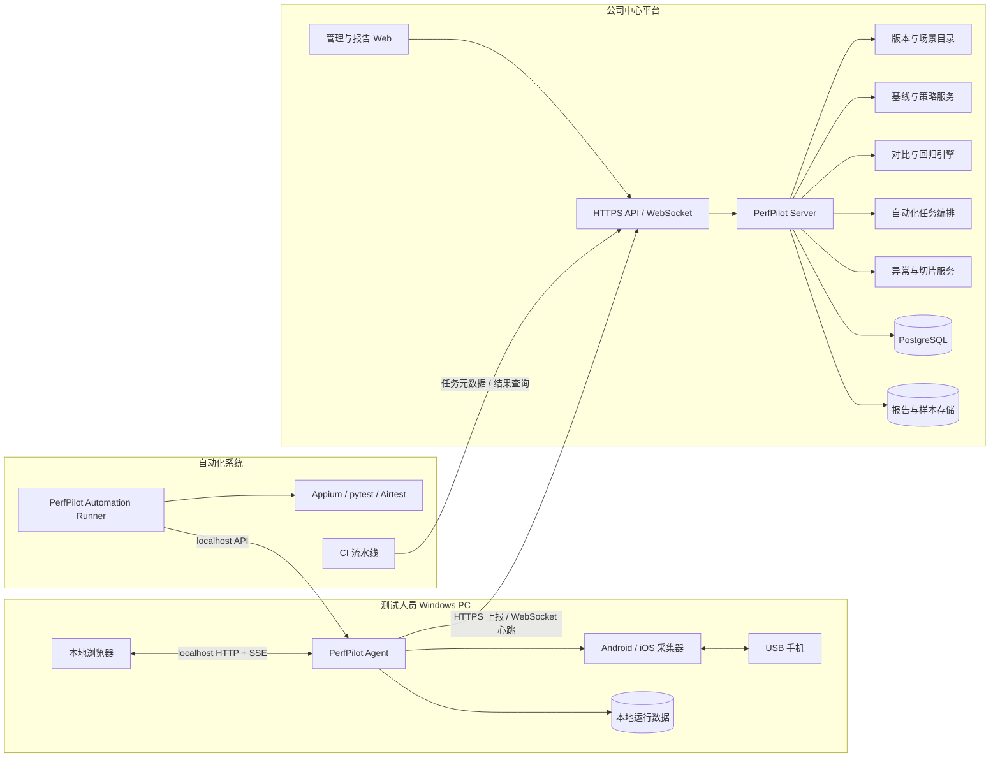
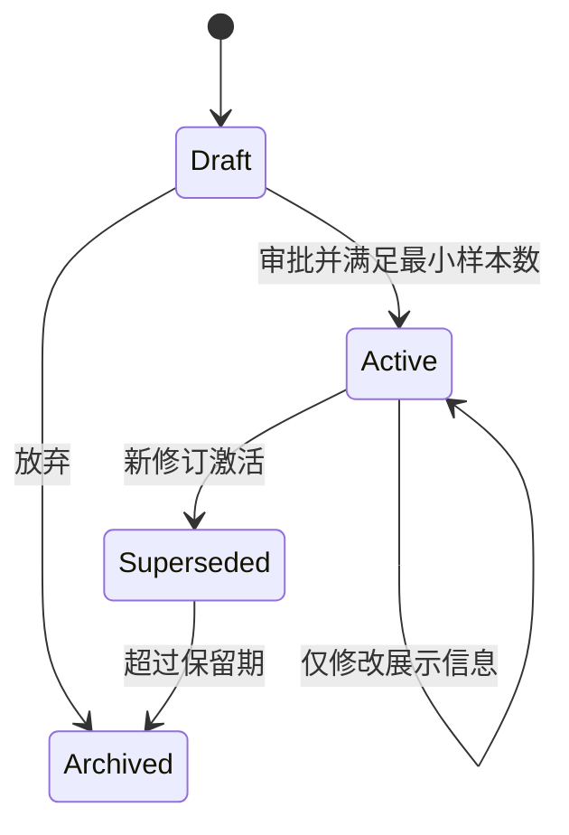
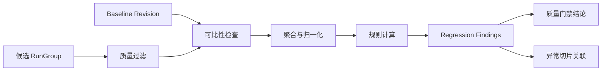
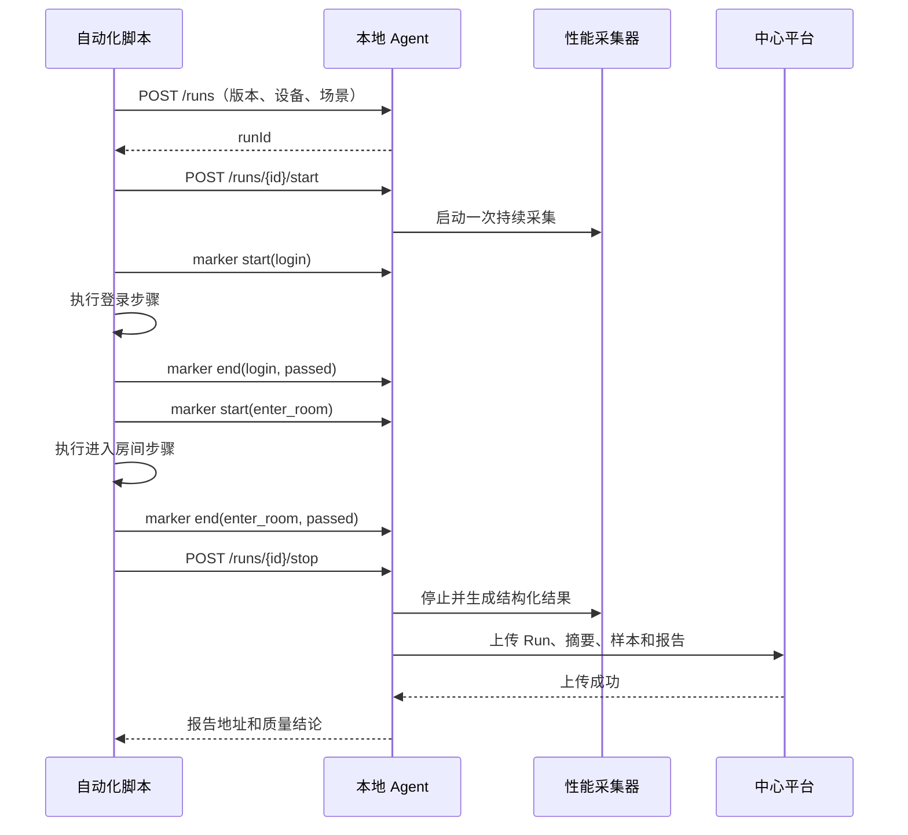
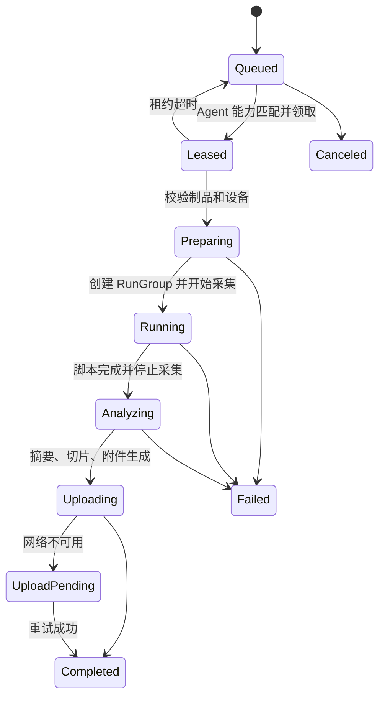
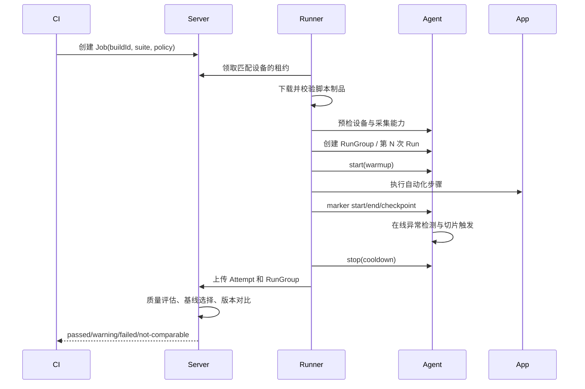
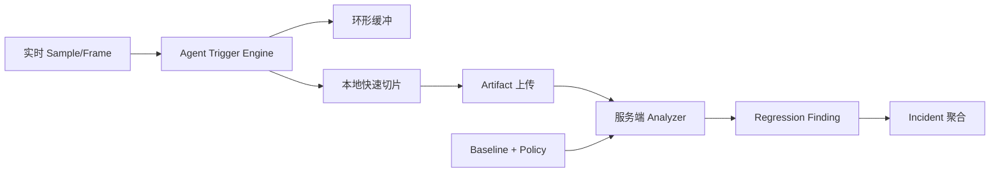

# PerfPilot 最终架构设计

> 本文档描述 PerfPilot 面向公司内部推广后的目标架构，覆盖员工本地性能测试、中心后台使用情况统计、App 版本管理、版本报告对比，以及与自动化测试平台联动。
>
> 设计原则：手机始终连接测试人员自己的 PC；性能采集在本地执行；中心平台负责身份、任务元数据、结果汇总、报告查询和版本对比，不直接访问 USB 设备。

---

## 1. 建设目标

PerfPilot 最终需要支持四种使用方式：

1. 测试人员安装客户端，连接手机后通过本地 Web 页面手动执行性能测试。
2. 管理人员在中心后台查看客户端在线情况、测试次数、成功率、设备分布和测试报告。
3. 自动化平台在执行 Appium、pytest、Airtest 等测试时，通过本地 Agent API 同步启动性能监测，并按功能模块生成报告。
4. 发布流水线按 App 构建和场景自动选择性能基线，执行多轮自动化测试，发现回归后自动生成问题切片并执行质量门禁。

最终形态不是单纯的“性能采集工具”，而是由两个平面组成的性能工程平台：

- **数据平面**：Agent、采集器和自动化 Runner 靠近设备执行，保证断网时仍能完成采集并落盘。
- **控制平面**：中心平台管理版本、基线、策略、脚本、任务、对比和问题闭环，不直接操作 USB，也不向 Agent 下发任意 Shell。

平台应始终遵守以下数据原则：原始事实不可变、派生结果可重算、基线变更可审计、脚本制品可追溯、自动结论必须说明可比条件和算法版本。

最终用户不需要安装 Python、配置虚拟环境或接触项目源码。Windows 首期发布为安装包：

```text
PerfPilot-Setup-x64.exe
```

安装后的操作流程：

```text
安装客户端 -> 连接手机 -> 双击 PerfPilot -> 浏览器自动打开 -> 选择 App -> 开始测试
```

## 2. 总体架构



中心平台首期可以是一个模块化单体服务，`Catalog / Baseline / Compare / Orchestrator / Incident` 是代码与数据边界，不要求立即拆成微服务。只有任务量、团队边界或扩缩容需求明确后再独立部署，避免过早引入分布式复杂度。

### 2.1 本地数据链路

```text
手机 -> ADB/pymobiledevice3 -> 采集器 -> Agent -> 本地网页
```

这条链路不能依赖中心服务器。公司网络暂时中断时，正在执行的测试应继续完成，并将结果放入待上传队列。

### 2.2 中心管理链路

```text
Agent -> 公司 HTTPS API -> 数据库/对象存储 -> 管理后台
```

中心平台只接收定义好的结构化数据和报告文件，不允许下发任意 Shell 命令。

## 3. 系统组件

### 3.1 PerfPilot Desktop

员工安装的 Windows 客户端，包含：

- 桌面启动器：启动本地 Agent 并自动打开浏览器。
- 本地 Web 控制台：沿用当前设备选择、实时监控和报告页面。
- 本地 Agent：设备发现、会话管理、自动化 API、离线上传队列。
- Android 采集器：封装 ADB、FPS、CPU、PSS 和 Jank 采集。
- iOS 采集器：封装 `pymobiledevice3`、FPS、CPU、Memory 和 GPU 采集。
- 本地数据目录：保存结构化样本、HTML 报告和上传状态。
- 自动更新器：检查并安装公司签名的客户端版本。

建议安装目录和数据目录分开：

```text
C:\Program Files\PerfPilot\          # 只读程序文件
%LOCALAPPDATA%\PerfPilot\            # 配置、日志和临时数据
%LOCALAPPDATA%\PerfPilot\runs\       # 测试运行数据
%LOCALAPPDATA%\PerfPilot\upload\     # 待上传队列
```

客户端只监听回环地址：

```text
http://127.0.0.1:8765
```

不开放局域网端口，避免其他电脑控制本机连接的手机。

### 3.2 PerfPilot Server

公司服务器上的中心服务，职责包括：

- 公司账号登录与权限管理。
- Agent 注册、版本检查、心跳和在线状态。
- App、版本、构建和测试场景管理。
- TestProfile、DeviceCohort、基线修订和回归策略管理。
- Run 元数据和指标摘要接收。
- 样本文件、HTML 报告和附件存储。
- 版本对比和性能回归判断。
- 自动化脚本制品、任务租约和执行记录管理。
- 在线 Trigger 复算、异常切片聚合和问题闭环。
- 使用统计和审计日志。
- 自动化流水线结果查询和质量门禁。

建议技术栈：

```text
后端：FastAPI
关系数据库：PostgreSQL
报告/样本：MinIO 或公司对象存储
缓存与任务队列：Redis（规模扩大后引入）
前端：复用现有 Web UI，增加管理和版本对比页面
入口：Nginx / 公司 API Gateway，统一 HTTPS
```

小规模试运行可以先使用 SQLite 和本地文件目录，但正式多人环境建议直接使用 PostgreSQL 和对象存储。

### 3.3 管理后台

后台至少提供以下页面：

| 页面       | 主要内容                                           |
| ---------- | -------------------------------------------------- |
| 总览       | 今日测试数、成功率、活跃用户、活跃 Agent、平台分布 |
| 客户端     | 用户、计算机、Agent 版本、在线状态、最后心跳       |
| 测试记录   | App、版本、设备、场景、执行人、时间、状态          |
| 报告详情   | 指标摘要、趋势、模块切片、原始报告下载             |
| 版本对比   | 基线版本与候选版本的指标差值和回归结论             |
| 基线策略   | 基线 revision、适用范围、审批、阈值和审计记录      |
| 脚本管理   | ScriptProject、制品版本、Suite、运行环境和审批     |
| 自动化任务 | 流水线、用例、模块、关联 Run 和执行状态            |
| 性能问题   | Regression Finding、自动切片、附件和修复验证       |
| 系统配置   | Agent 版本、指标阈值、数据保留策略、权限           |

## 4. 客户端分层

当前采集脚本可以保留，但应逐步形成以下边界：

```text
Desktop Launcher
      |
Local API / Session Manager
      |
Collector Adapter
      |-- AndroidCollector -> adb_fps.py
      `-- IOSCollector     -> ios_perf.py
      |
Event Bus
      |-- 本地 SSE 实时展示
      |-- JSONL 持久化
      `-- 后台上传队列
```

采集器不再以面向用户的控制台文本作为唯一输出，而是产生统一事件：

```json
{
  "schemaVersion": 1,
  "type": "sample",
  "runId": "01K4ABC...",
  "timestampMs": 1788748982300,
  "elapsedMs": 12400,
  "metrics": {
    "fps": 58.4,
    "appCpuPct": 26.1,
    "memoryMiB": 812.5,
    "gpuPct": null,
    "networkDownMiB": null,
    "networkUpMiB": null
  }
}
```

HTML、实时页面和中心后台都消费该事件模型，不再通过正则解析标准输出。

## 5. 核心数据模型

### 5.1 App 和版本

```text
Application
  id
  name
  platform
  packageId / bundleId

ReleaseVersion
  id
  applicationId
  versionName

Build
  id
  releaseVersionId
  versionCode
  ciBuildId
  gitCommit
  branch
  artifactDigest
  createdAt
```

版本信息获取顺序：

1. CI 或自动化平台显式传入。
2. 从设备中已安装的 App 元数据读取。
3. 用户手动补充。

同一个 `versionName` 可能对应多个构建，因此版本比较和基线必须引用不可变 `Build.id`，不能只使用展示版本号。`versionCode/ciBuildId/gitCommit/artifactDigest` 用于解析和追溯 Build。

### 5.2 Test Run

每次测试创建独立 Run：

```json
{
  "schemaVersion": 1,
  "runId": "01K4ABC...",
  "source": "manual",
  "applicationId": "hepsioyna-ios",
  "versionName": "3.12.0",
  "versionCode": "312001",
  "buildId": "CI-1842",
  "environment": "staging",
  "scenarioId": "enter-room",
  "automationRunId": null,
  "userId": "employee-id",
  "agentId": "agent-id",
  "device": {
    "platform": "ios",
    "model": "iPhone17,1",
    "osVersion": "27.0",
    "cpuCount": 6,
    "refreshRateHz": 60
  },
  "startedAtMs": 1788748979875,
  "endedAtMs": 1788749099875,
  "status": "completed",
  "tags": ["release-candidate"]
}
```

### 5.3 本地文件格式

每次 Run 至少产生：

```text
runs/{runId}/run.json          # 元数据、状态、摘要
runs/{runId}/samples.jsonl     # 原始结构化样本
runs/{runId}/markers.jsonl     # 功能模块和自定义事件
runs/{runId}/report.html       # 本地可浏览报告
```

HTML 不是原始数据。版本对比和模块报告必须基于结构化数据计算。

### 5.4 指标摘要

后台不必每次读取所有原始样本。客户端完成 Run 后生成摘要：

```text
FPS：平均值、最低值、P10、P50、P90、低帧率占比
CPU：平均值、P50、P90、P95、峰值
内存：平均值、峰值、起止差值、线性增长率
GPU：平均值、P90、峰值
网络：总上传、总下载、峰值速率
质量：样本数、缺失率、采集错误数
```

### 5.5 版本、构建和发布通道

`versionName` 是用户看到的业务版本，不能作为一次构建的唯一标识。建议把版本目录拆为以下层级：

```text
Project
  `-- Application                 # Android/iOS App
        `-- ReleaseVersion        # 3.12.0，业务版本
              `-- Build           # 不可变构建实体
                    |-- Android versionCode / iOS CFBundleVersion
                    |-- CI buildId
                    |-- gitCommit
                    |-- branch
                    |-- channel   # dev / staging / gray / production
                    |-- artifactDigest
                    `-- createdAt
```

约束如下：

- `Application` 由 `projectId + platform + packageId` 唯一确定。
- `ReleaseVersion` 允许包含多个 Build；重新打包必须产生新 Build，不能覆盖旧记录。
- Build 一旦进入测试就不可修改，只允许补充展示信息；安装包使用 SHA-256 等摘要去重和追溯。
- 从设备读取到的版本只能用于匹配 Build，匹配不到时创建 `unresolved build`，等待 CI 元数据或人工确认。
- CI 显式传入的 `buildId/gitCommit/artifactDigest` 优先级高于设备推断值。

### 5.6 场景、配置和可比性指纹

版本对比的基本单位不是“两个版本”，而是相同测试契约下的两个 `RunGroup`。测试契约由三个带修订号的对象组成：

```text
TestScenario
  id / revision / name / tags
  前置条件、业务步骤、预期时长

TestProfile
  id / revision
  warmupSeconds / cooldownSeconds / sampleIntervalMs
  collectors / metrics / repeatCount / timeoutSeconds

DeviceCohort
  id / revision
  platform / modelPatterns / osMajor / refreshRateHz
  performanceTier / requiredCapabilities
```

Run 创建时固化一份 `comparisonFingerprint`，避免后来修改场景或配置导致历史数据含义漂移：

```json
{
  "applicationId": "app-ios-hepsioyna",
  "scenario": {"id": "enter-room", "revision": 4},
  "testProfile": {"id": "release-perf", "revision": 2},
  "deviceCohort": "iphone-pro-120hz",
  "platform": "ios",
  "osMajor": "27",
  "refreshRateHz": 120,
  "environment": "staging",
  "collectorVersion": "ios-pymd3-v3",
  "metricSchemaVersion": 2,
  "analyzerVersions": {
    "summary": "summary-v2",
    "jank": "perfdog-display-frametime-v1"
  }
}
```

指纹字段分两类：

- **硬条件**：App、平台、场景修订、关键采集源、指标算法。不同则 `not-comparable`。
- **软条件**：设备同档但非同型号、补丁版本、轻微时长差异。允许展示，但降低可信等级并给出差异说明。

### 5.7 RunGroup、重复运行和派生数据

一次执行容易受到温度、网络和后台任务干扰。自动化版本比较应以 `RunGroup` 聚合多次 Run：

```text
RunGroup
  id
  buildId
  scenarioRevision
  testProfileRevision
  comparisonFingerprintHash
  expectedRuns
  validRuns
  aggregationStatus
  aggregateSummary
```

建议默认执行 3 次，先按质量规则剔除无效 Run，再对有效 Run 的摘要取中位数。数据量足够时同时保存 P25/P75、MAD 或置信区间，避免只比较两个偶然样本。

原始与派生数据必须分层：

```text
事实层：Run、Sample、Frame、Marker、设备环境快照、原始附件
派生层：RunSummary、SegmentSummary、RunGroupSummary
结论层：Comparison、RegressionFinding、Incident
```

派生记录必须保存 `analyzerVersion` 和输入摘要。算法升级时新建派生版本，不覆盖旧结论，从而支持重算、审计和新旧算法并行验证。

### 5.8 环境快照和数据质量

Run 开始与结束时采集环境快照，至少包括：

- 电量、充电状态、低电量模式和可获得的热状态。
- 前台 App、设备锁屏状态、网络类型和是否使用 VPN。
- 屏幕刷新率、分辨率、横竖屏和采集源。
- Agent、采集器、脚本制品和指标算法版本。
- 采样间隔、丢样率、采集器重启次数和时间同步偏差。

每个 Run 先经过 `QualityEvaluator`：

```text
valid / degraded / invalid
```

`invalid` Run 不进入基线或自动门禁；`degraded` Run 可以展示，但需要策略明确允许才能参与聚合。质量结论必须先于性能回归结论，避免把采集故障误判成 App 回归。

## 6. 版本管理与报告对比

### 6.1 可比较条件

后台默认只对满足以下条件的 Run 给出明确回归结论：

- 相同 App 和测试场景。
- 相同设备型号或相同设备分组。
- 相同操作系统主版本。
- 相同刷新率。
- 相近测试时长和采样配置。
- 相同运行环境。

条件不同仍可查看数据，但页面显示“实验条件不一致”，不自动判定版本回归。

### 6.2 对比方式

```text
候选版本指标变化率 = (候选值 - 基线值) / 基线值 * 100%
```

FPS 等“越高越好”的指标下降视为负向；CPU、内存等“越低越好”的指标上升视为负向。

建议支持：

- 当前版本对比上一稳定版本。
- 任意两个构建对比。
- 同一版本多次测试的中位数对比。
- 同一功能模块对比。
- 同一版本跨设备分组对比。

### 6.3 回归规则

阈值应由 App 或场景配置，示例：

```text
CPU P95 增长 > 15%             -> warning
CPU P95 增长 > 25%             -> failed
内存峰值增长 > 100 MiB         -> failed
平均 FPS 下降 > 5              -> warning
FPS < 25 的时间占比增加 > 10%  -> failed
样本缺失率 > 20%               -> invalid
```

结论至少分为：

```text
passed / warning / failed / invalid / not-comparable
```

### 6.4 基线不是一个版本号

基线应是一个不可变的、带适用范围和数据快照的实体，而不是在 ReleaseVersion 或 Build 上加 `isBaseline=true`：

```text
PerformanceBaseline
  id
  applicationId
  name
  scope                     # scenario + profile + device cohort + environment
  revision
  sourceBuildId
  sourceRunGroupIds
  aggregateSnapshot
  comparisonFingerprintHash
  analyzerVersions
  status                    # draft / active / superseded / archived
  effectiveFrom / effectiveTo
  createdBy / approvedBy
  reason / auditLogId
```

这样设计可以同时支持：

- 同一个稳定版本针对不同场景、设备档位维护不同基线。
- 基线使用稳定版本的多次 Run 聚合，而不是任选一次报告。
- 修复算法后生成新的基线 revision，旧报告仍能解释当时使用的基线。
- 灰度、正式、专项测试使用不同基线，不互相污染。

基线和阈值策略必须分离：基线描述“历史表现是什么”，`RegressionPolicy` 描述“允许变化多少”。更换阈值不应重写基线，更换基线也不应静默改变历史 Comparison。

### 6.5 基线生命周期



建议规则：

1. 手工创建或由最近稳定 Build 推荐为 `draft`。
2. 至少包含策略要求的有效 Run 数，例如同设备档位 3 次。
3. 系统展示波动度、异常值和环境差异，由项目管理员审批为 `active`。
4. 新基线激活时旧基线进入 `superseded`，已生成的 Comparison 继续引用旧 baseline revision。
5. 自动滚动基线只能生成候选修订，默认不能跳过审批；低风险内部项目可配置自动审批。
6. 被判定为回归的候选 Build 不能自动成为新基线，防止性能逐版本劣化。

### 6.6 基线选择优先级

候选 RunGroup 发起对比时，按以下顺序选择基线：

1. CI/用户显式指定的 `baselineId + revision`。
2. 完全匹配 App、场景修订、TestProfile、DeviceCohort 和环境的 active 基线。
3. 匹配同场景和兼容设备档位的 active 基线，但结论降级并提示差异。
4. 找不到时返回 `baseline-missing`，允许展示当前结果但不执行门禁。

选择结果必须固化到 Comparison，不能因为后来激活了新基线而改变已有流水线结论。

### 6.7 对比引擎流水线



计算步骤：

1. 过滤 `invalid` Run，检查有效重复次数。
2. 比较完整 fingerprint，生成硬差异和软差异列表。
3. 对每个指标确定方向、单位、聚合函数和缺失策略。
4. 同时计算绝对差、相对差和波动度；分母接近 0 时禁用相对差。
5. 对模块/Marker 区间分别计算，不能只比较整段平均值。
6. 应用 `RegressionPolicyRevision`，生成结构化 Finding。
7. 汇总门禁结论，保存完整输入引用和算法版本。

单个 Finding 示例：

```json
{
  "metric": "cpu.p95",
  "segment": "enter_room",
  "direction": "lower_is_better",
  "baselineValue": 41.2,
  "candidateValue": 52.8,
  "absoluteDelta": 11.6,
  "relativeDeltaPct": 28.16,
  "threshold": {"warningPct": 15, "failedPct": 25},
  "severity": "failed",
  "confidence": "high",
  "baselineRevision": 3,
  "policyRevision": 5
}
```

### 6.8 规则、噪声和最终结论

`RegressionPolicy` 支持项目默认、App、场景和指标四级覆盖，越具体优先级越高。规则至少支持：

```text
relative_delta / absolute_delta / upper_limit / lower_limit
duration_ratio / occurrence_count / missing_rate
```

建议增加以下抗噪策略：

- 同时满足最小绝对差和最小相对差，过滤小数值抖动。
- 候选差值没有超过基线历史波动带时降低置信度。
- 只有一个有效 Run 时允许人工对比，但默认不阻断 CI。
- 同一次任务出现多个相关指标异常时合并为一个问题，例如 FPS 下降与 Jank 增加。
- `failed`、`warning` 与“统计可信度低”分别表达，不把不确定性伪装成通过。

最终状态优先级：

```text
invalid > not-comparable > failed > warning > passed
```

其中 `baseline-missing` 单独记录，是否阻断流水线由项目策略决定。

### 6.9 横向对比视图

后台提供三种视图：

1. **Build 对比**：候选 Build 对一个固定 baseline revision。
2. **版本矩阵**：多个 ReleaseVersion/Build 按时间横向展示趋势。
3. **场景下钻**：同一指标按 Marker 区间、设备档位和重复轮次查看分布。

页面必须同时显示基线值、候选值、绝对差、相对差、阈值、可信度、样本数和环境差异。不能只显示红绿颜色，也不能在条件不一致时给出“回归/通过”的强结论。

## 7. 自动化测试联动

### 7.1 集成边界

自动化测试运行在测试人员 PC 或自动化执行机上，通过本地 Agent API 控制性能采集：

```text
http://127.0.0.1:8765/api/v1
```

自动化框架不能直接导入 Android/iOS 采集器内部代码，避免版本耦合。

### 7.2 Run 生命周期



一次自动化流程只启动一次底层采集。功能模块通过 marker 在同一时间轴上切片，避免反复连接 Instruments 或 ADB 带来的空档和额外开销。

### 7.3 本地自动化 API

```text
POST /api/v1/runs
POST /api/v1/runs/{runId}/start
POST /api/v1/runs/{runId}/markers
POST /api/v1/runs/{runId}/stop
GET  /api/v1/runs/{runId}
GET  /api/v1/runs/{runId}/report
```

创建 Run：

```json
{
  "source": "automation",
  "deviceId": "00008030...",
  "packageId": "com.yalla.hepsioyna1",
  "versionName": "3.12.0",
  "buildId": "CI-1842",
  "scenarioId": "room-regression",
  "automationRunId": "appium-9182"
}
```

模块打点：

```json
{
  "name": "enter_room",
  "displayName": "进入房间",
  "event": "start",
  "timestampMs": 1788748982300
}
```

Marker 应支持：

```text
start / end / checkpoint / error
```

并保存模块状态：

```text
passed / failed / skipped
```

### 7.4 SDK 与 CLI

在 HTTP API 稳定后，可以提供轻量 Python SDK：

```python
with perf_run(app="hepsioyna", build_id="CI-1842") as run:
    with run.step("login"):
        login()

    with run.step("enter_room"):
        enter_room()
```

非 Python 自动化使用 CLI：

```powershell
PerfPilot.exe run start --build CI-1842 --scenario room-regression
PerfPilot.exe marker start --run RUN_ID --name login
PerfPilot.exe marker end --run RUN_ID --name login --status passed
PerfPilot.exe run stop --run RUN_ID
```

### 7.5 脚本管理模型

自动化脚本不能作为可编辑文本直接塞进 Job，也不能由中心平台转换成任意 Shell 下发。建议采用“脚本项目 + 不可变制品 + 固定 Runner Adapter”的模型：

```text
ScriptProject
  id / projectId / name / framework / repository
  `-- ScriptVersion
        id / gitCommit / artifactDigest / manifest
        dependencyLock / createdBy / approvedAt
        `-- TestSuite
              `-- TestCase

RuntimeProfile
  pythonVersion / frameworkVersion
  dependencyImageOrLock / environmentVariables
  requiredCapabilities / timeout / retryPolicy

SecretRef
  只保存密钥系统引用，不把明文写进脚本制品或 Run
```

脚本制品可以来自 Git Commit、CI 生成的 ZIP/Wheel，或内部制品库。服务端保存摘要、Manifest 和签名；执行时按 digest 下载和校验，同一个 `ScriptVersion` 永远指向同一份内容。

Manifest 示例：

```yaml
schemaVersion: 1
framework: pytest-appium
entrypoint: tests/performance
suites:
  - id: room-regression
    cases:
      - test_login
      - test_enter_room
requiredCapabilities:
  - android
timeoutSeconds: 1800
markerMode: sdk
```

### 7.6 Automation Runner 边界

自动化执行与性能采集权限不同，建议在客户端内部保持逻辑隔离：

```text
PerfPilot Agent
  设备、Run、Collector、Marker、Artifact、上传

PerfPilot Automation Runner
  Job 租约、脚本下载校验、隔离工作目录、框架适配、超时终止
  |-- PytestAdapter
  |-- AppiumAdapter
  `-- AirtestAdapter
```

首期可以同进程不同模块，接口稳定后再拆为子进程。Runner 只能调用 Agent 的结构化本地 API，不直接写 `runs/`，也不能绕过设备锁启动第二个采集器。

安全约束：

- 只有已审批、已签名且摘要匹配的脚本制品可以由远程任务执行。
- Runner 使用固定参数数组启动白名单解释器/框架，不拼接命令字符串。
- 每次执行使用独立工作目录和受控环境变量；结束后按保留策略清理。
- Token、账号等通过 `SecretRef` 在执行时注入，日志必须脱敏。
- 为脚本设置 CPU、内存、磁盘、超时和子进程数量限制；Windows 首期可使用 Job Object，后续可接容器化执行机。

### 7.7 自动化任务和状态机

```text
AutomationJob
  id / projectId / buildId
  scriptVersionId / suiteId
  scenarioIds / testProfileRevision
  targetDeviceSelector
  baselineSelector / policyRevision
  priority / scheduledAt / createdBy

AutomationAttempt
  id / jobId / attemptNo / agentId / deviceId
  leaseToken / status / timestamps
  runGroupIds / errorCategory / artifactManifest
```

状态机：



服务端使用短期租约而不是永久分配。Agent 崩溃或断网后租约过期，Job 根据幂等键和重试策略重新排队；同一个 Attempt 不得重复创建 RunGroup。

### 7.8 一次任务的执行顺序



失败分类至少区分：脚本断言失败、设备离线、App 崩溃、采集器失败、环境准备失败、上传失败和性能门禁失败。脚本功能失败不应被误写成性能回归，但本次性能数据和异常切片仍可保留用于诊断。

### 7.9 Marker 契约

当前 `scene/scriptFn` 可兼容保留，但目标协议应使用成对事件和稳定 ID：

```json
{
  "markerId": "mk-01K...",
  "parentMarkerId": null,
  "scenarioId": "room-regression",
  "caseId": "test_enter_room",
  "stepId": "enter-room",
  "name": "进入房间",
  "event": "start",
  "status": null,
  "timestampMs": 1788748982300,
  "attributes": {"attempt": 1}
}
```

规则：

- `start/end` 使用同一个 `markerId`，允许父子嵌套但不允许区间交叉。
- Agent 记录接收时间和调用方时间；偏差超过阈值时以 Agent 时间为准并标记质量降级。
- 脚本异常退出时 Agent 自动关闭未结束 Marker，状态设为 `aborted`。
- 报告切片使用 Marker 区间，不再依赖“后续样本继承最后一个 scene”的隐式语义。

### 7.10 调度和设备选择

Job 使用能力选择器而不是固定 UDID：

```json
{
  "platform": "android",
  "deviceCohort": "android-high-120hz",
  "osMajor": [14, 15],
  "requiredCapabilities": ["fps", "app_cpu", "memory", "frame_time"],
  "labels": ["lab-shanghai"]
}
```

调度器只选择空闲且心跳正常的 Agent/设备。设备锁从“单个 Run”提升为带租约的资源锁，覆盖安装 App、预热、重复运行和清理全过程，避免其他手工测试插入同一设备。

## 8. 中心通信协议

### 8.1 Agent 注册和心跳

客户端首次启动生成不可变 `agentId`，用户登录后绑定公司账号。Agent 定期发送：

```json
{
  "agentId": "agent-abc123",
  "agentVersion": "1.0.0",
  "hostName": "QA-PC-01",
  "os": "Windows 11",
  "userId": "employee-id",
  "capabilities": ["android", "ios"],
  "activeRunId": null,
  "timestampMs": 1788748982300
}
```

后台由此统计在线人数、客户端版本和使用情况。

### 8.2 上传策略

- Run 完成后先写本地文件，再异步上传。
- 上传失败进入持久化队列，采用指数退避重试。
- `runId` 作为幂等键，重复上传不会产生两条记录。
- 摘要先上传，较大的样本和报告后上传。
- 服务端返回文件校验值，客户端确认后标记完成。
- 默认保留本地最近 30 天数据，策略可由后台配置。

### 8.3 上传内容

建议上传：

- 用户、Agent 和客户端版本。
- App、构建、场景和自动化任务标识。
- 设备型号、系统版本和采集能力。
- Run 状态、持续时间和错误分类。
- 指标摘要、模块摘要、结构化样本和 HTML 报告。

默认不上传：

- 手机截图。
- App 页面内容。
- 任意 Shell 输出。
- 与性能测试无关的设备个人数据。
- 未脱敏的完整设备 UDID。

设备标识上传前应使用公司级盐值进行不可逆哈希。

## 9. 安全设计

### 9.1 客户端安全

- 使用公司代码签名证书签名安装包和更新包。
- 程序安装到只读目录，普通用户数据写入 `%LOCALAPPDATA%`。
- 本地 API 只监听 `127.0.0.1`。
- 本地页面启动时使用短期会话令牌，防止其他网页调用 Agent。
- Agent 只接受白名单动作和结构化参数，不接受任意命令字符串。
- 同一设备同一时间只允许一个 Run。

### 9.2 中心平台安全

- 全链路使用 HTTPS/WSS。
- 用户接入公司 SSO；Agent 使用设备凭证或短期 Token。
- 权限建议分为测试人员、项目管理员和平台管理员。
- 用户只能查看被授权项目的数据。
- 所有启动、停止、上传、删除和阈值修改写入审计日志。
- 报告下载使用鉴权接口或短期签名 URL。

### 9.3 源码保护

首期可使用 PyInstaller 打包，满足“不直接分发 `.py` 文件”和简化安装。若需要提高逆向门槛，可采用 Nuitka 编译关键模块。

需要明确：Python 打包不能提供绝对防逆向。真正的保护措施是代码签名、最小权限、协议鉴权，以及不在客户端内放置服务器密钥。

## 10. 部署拓扑

### 10.1 客户端发布

```text
源代码 -> CI 构建 -> 自动化测试 -> 签名 -> PerfPilot-Setup-x64.exe
                                              |
                                              `-> 公司软件中心/内网下载页
```

安装包应包含：

- PerfPilot Agent 和本地 Web 资源。
- Python 运行时或已编译程序。
- Android Platform Tools。
- `pymobiledevice3` 及其依赖。
- 启动菜单和桌面快捷方式。
- 卸载程序和自动更新器。

iOS 仍依赖 Apple Mobile Device 驱动；客户端应在启动时检测并显示明确安装指引。

### 10.2 服务端部署

```text
公司域名
   |
Nginx / API Gateway
   |
PerfPilot Server（可水平扩展）
   |-- PostgreSQL
   |-- MinIO/对象存储
   `-- Redis（后续）
```

正式环境至少划分：

```text
dev / staging / production
```

数据库做每日备份，对象存储设置生命周期和访问策略。

## 11. API 边界建议

### 本地 Agent API

```text
GET  /api/v1/devices
GET  /api/v1/devices/{id}/applications
POST /api/v1/runs
POST /api/v1/runs/{id}/start
POST /api/v1/runs/{id}/markers
POST /api/v1/runs/{id}/stop
GET  /api/v1/runs/{id}
GET  /api/v1/runs/{id}/stream
GET  /api/v1/runs/{id}/report
GET  /api/v1/runs/{id}/incidents
POST /api/v1/automation/attempts/{id}/heartbeat
```

### 中心平台 API

```text
POST /api/v1/agents/register
POST /api/v1/agents/heartbeat
POST /api/v1/runs
PUT  /api/v1/runs/{id}
POST /api/v1/runs/{id}/artifacts
GET  /api/v1/runs
GET  /api/v1/runs/{id}
POST /api/v1/comparisons
GET  /api/v1/comparisons/{id}
GET  /api/v1/applications/{id}/versions
POST /api/v1/applications/{id}/builds
GET  /api/v1/applications/{id}/baselines
POST /api/v1/baselines
POST /api/v1/baselines/{id}/revisions
POST /api/v1/baselines/{id}/activate
GET  /api/v1/regression-policies/{id}
POST /api/v1/script-projects/{id}/versions
POST /api/v1/automation/jobs
POST /api/v1/automation/jobs/lease
POST /api/v1/automation/attempts/{id}/complete
GET  /api/v1/incidents
GET  /api/v1/incidents/{id}/artifacts
GET  /api/v1/usage/summary
```

本地 API 与中心 API 使用独立命名空间和认证策略，避免客户端内部接口被误当成公网接口。

所有写接口需要支持：

- `Idempotency-Key`，应对 Agent 和 CI 重试。
- 乐观锁或 `revision`，防止基线、策略和脚本版本并发覆盖。
- 审计上下文，包括用户、Agent、Job、来源 IP 和变更原因。
- 分页、时间范围和项目范围，避免版本趋势查询退化为全表扫描。

## 12. 分阶段实施

### Phase 1：可分发的本地客户端

目标：公司员工无需开发环境即可自行测试。

- 将当前项目打包成 Windows x64 安装包。
- 一键启动本地 Agent，并自动打开浏览器。
- 保留现有 Android/iOS 手动测试能力。
- 每个 Run 生成 `run.json`、`samples.jsonl` 和 `report.html`。
- 引入统一 Run ID、统一毫秒时间戳和事件 Schema。
- 完成本地日志、错误提示和设备占用锁。

### Phase 2：中心后台与使用统计

目标：后台可查看所有人的使用情况和报告。

- 公司账号登录与 Agent 绑定。
- Agent 心跳、版本和在线状态。
- Run 摘要、报告和样本异步上传。
- 使用总览、测试记录和报告查询。
- 离线上传重试、幂等和数据保留策略。

### Phase 3：版本管理与报告对比

目标：识别版本性能变化。

- App、版本、构建和场景模型。
- RunGroup、TestProfile、DeviceCohort 和可比性指纹。
- 自动读取 App 版本信息。
- 可比较条件检查。
- 双版本报告、模块对比和回归阈值。
- 不可变基线 revision、审批、策略版本和回归通知。
- 候选 Build 对固定基线的 CI 质量门禁。

### Phase 4：自动化联动

目标：自动化执行时同步产生模块级性能报告。

- 本地 Run 生命周期 API。
- Marker 协议和模块切片。
- Python SDK 和通用 CLI。
- Appium、pytest、Airtest 集成示例。
- ScriptProject、不可变 ScriptVersion 和 Runner Adapter。
- Job 租约、设备能力调度、重复运行和自动化任务关联。
- 脚本签名校验、SecretRef、资源限制和审计。

### Phase 5：在线异常检测与问题切片

目标：性能问题出现时自动保留可诊断上下文并形成问题闭环。

- 本地环形缓冲、Trigger Engine 和 pre/post-roll 切片。
- 基于规则的在线检测与服务端权威复算。
- Incident、RegressionFinding、Marker 和切片关联。
- 样本、逐帧、日志、环境快照和可选屏幕录制附件。
- 去抖、合并、限流、隐私和存储预算。
- 与缺陷平台、IM 通知和 CI 门禁联动。

## 13. 扩展指标模块

本模块用于承载显存/GPU 资源、网络流量和电量/能耗三个扩展指标。它们不应直接复用 `gpuPct`、`networkDownMiB` 这类过于宽泛的字段，而应同时记录数值、单位、统计范围和数据质量。

### 13.1 统一指标约定

每个扩展指标至少包含以下元数据：

```json
{
  "value": 1048576,
  "unit": "bytes",
  "scope": "process",
  "quality": "measured",
  "source": "android.uid.traffic",
  "availability": "available"
}
```

字段定义：

| 字段             | 可选值                                                           | 含义                                      |
| ---------------- | ---------------------------------------------------------------- | ----------------------------------------- |
| `unit`         | `bytes`、`bytes_per_second`、`percent`、`energy_cost` 等 | 数值单位，禁止依赖字段名猜测              |
| `scope`        | `process`、`device`、`system`、`engine`                  | 数据属于 App、设备、系统还是 App/引擎埋点 |
| `quality`      | `measured`、`estimated`、`inferred`                        | 实测、系统估算或推导值                    |
| `source`       | 平台接口标识                                                     | 具体采集来源，便于排查设备差异            |
| `availability` | `available`、`degraded`、`unavailable`                     | 当前设备是否提供该指标                    |

报告和后台必须显示这些信息。例如：

```text
App 网络下载：12.4 MiB/s · process · measured
设备网络总量：18.1 MiB/s · device · measured
App 能耗：1.82 · process · estimated
VBO：不可用 · 需要 App/引擎埋点
```

### 13.2 显存与 GPU 资源

用户需求中的 VBO 属于 App 图形资源细分指标，不能等同于 GPU 利用率或进程内存。

#### Android 能力

可尝试采集：

```text
Graphics memory
GL memory
EGL memory
GPU mapped memory
GPU utilization
```

主要来源包括 `dumpsys meminfo <package>`、Perfetto、Android GPU Inspector 和厂商 GPU 接口。但字段和含义会随 Android 版本、GPU 厂商、OpenGL/Vulkan 引擎而变化，不能保证拆出精确 VBO。

#### iOS 能力

现有 DVT/tidevice 路径可以获得部分 GPU 利用率，例如：

```text
Device Utilization
Tiler Utilization
Renderer Utilization
```

这些数据不等于显存或 VBO。iOS 设备采用统一内存架构，GPU 资源通常应描述为 Metal/OpenGL resource memory，而不是传统独立 VRAM。

#### 设计结论

系统采集层提供设备相关的估算值：

```json
{
  "gpu": {
    "deviceUtilizationPct": 42.5,
    "rendererUtilizationPct": 37.2,
    "tilerUtilizationPct": 28.0,
    "memoryBytes": null,
    "vboBytes": null,
    "scope": "device_or_process",
    "quality": "estimated"
  }
}
```

精确 VBO、纹理、Framebuffer 或 Metal resource bytes 应由 App/引擎主动埋点：

```json
{
  "type": "custom_gpu_resource",
  "metrics": {
    "vboBytes": 10485760,
    "textureBytes": 52428800,
    "framebufferBytes": 8388608
  },
  "scope": "engine",
  "quality": "measured"
}
```

因此 VBO 不作为所有 Android/iOS 设备都必须支持的通用指标，而作为可选的 `engine` 扩展指标。

### 13.3 网络流量

网络指标应区分累计量和速率：

```text
累计下载量 = 当前累计接收字节数 - 上一次累计接收字节数
下载速率 = 累计下载量 / 两次采样间隔
```

统一字段建议：

```json
{
  "network": {
    "rxBytes": 1048576,
    "txBytes": 524288,
    "rxBytesPerSecond": 65536,
    "txBytesPerSecond": 32768,
    "scope": "process",
    "quality": "measured"
  }
}
```

#### Android

优先按 App UID 统计上传和下载流量，可使用 `TrafficStats`、系统网络统计或 UID 维度的 `/proc` 数据。需要处理多进程、VPN、代理、Wi-Fi/移动网络切换和系统版本差异。

Android App 流量属于正式支持目标；当 UID 级接口不可用时，应降级为 `device` 范围并明确标记，不能伪装成 App 流量。

#### iOS

旧版 tidevice/DVT 存在按 PID 查询网络统计的实验性接口，但当前通用网络迭代接口更接近设备或连接级数据；部分系统和场景中收发字节字段可能不完整。iOS 27 的 `pymobiledevice3` 后端暂不保证提供 App 级网络流量。

iOS 网络指标分阶段实现：

1. 初版显示设备级网络数据或明确显示不可用。
2. 后续验证 DVT PID 级网络统计，并记录接口版本和误差。
3. 只有确认按 App/PID 过滤后，才标记为 `scope: process`。

### 13.4 电量与能耗

“单位时间内应用消耗的电荷数量”需要区分真实电荷和系统能耗模型：

```text
真实电荷：mAh / Coulomb，需要硬件或经过校准的电池测量
能耗估算：energy_cost / power estimate，由系统模型推导
```

#### Android

可通过 `dumpsys batterystats` 获取 UID 相关的电池消耗估算、CPU 时间、网络、唤醒锁等数据。它适合输出：

```text
App Energy Estimate
Estimated Power
Battery Impact
```

如果换算为 mAh，字段必须命名为 `estimatedMah`，不能表示为真实电荷测量值。

#### iOS

Xcode Energy Statistics/DVT 路径可能返回 CPU、GPU、网络、显示等能耗成本，但这些通常是系统能耗模型中的相对或估算值，不等于真实 mAh。现有 tidevice 依赖包含实验性的进程能耗查询能力；iOS 27 `pymobiledevice3` 路径需要单独验证后才能接入。

建议统一模型：

```json
{
  "energy": {
    "value": 1.82,
    "unit": "energy_cost",
    "scope": "process",
    "quality": "estimated",
    "source": "ios.dvt.energy"
  }
}
```

正式报告中不得把 `energy_cost` 直接写成“消耗 1.82 mAh”。若需要真实 mAh，必须引入外部电源分析仪、专用夹具或经过验证的设备校准方案。

### 13.5 平台能力矩阵

| 指标                 | Android    | iOS      | 第一阶段策略                     |
| -------------------- | ---------- | -------- | -------------------------------- |
| GPU 利用率           | 部分可用   | 部分可用 | 支持时显示来源和能力状态         |
| Graphics/GL/EGL 内存 | 可尝试     | 设备相关 | 作为估算值，不承诺统一含义       |
| 精确 VBO             | 不通用     | 不通用   | 由 App/引擎埋点提供              |
| App 网络流量         | 可正式支持 | 实验性   | Android 优先，iOS 先降级或不可用 |
| 设备网络流量         | 可支持     | 可支持   | 明确标注`scope: device`        |
| App 能耗估算         | 可支持     | 实验性   | 使用`energy_cost`，不承诺 mAh  |
| 真实 App 电荷        | 不通用     | 不通用   | 需要外部硬件测量                 |

### 13.6 版本对比和自动化报告

扩展指标必须进入统一的 Run 摘要和模块摘要，以支持版本回归：

```text
网络：App 下载 P95、上传 P95、总流量
能耗：energy_cost 平均值、单位时间成本
GPU：利用率 P90、Graphics memory 峰值、VBO 峰值（仅 engine 埋点）
```

比较时必须同时比较 `scope`、`quality`、`source` 和设备条件。以下情况只能展示数据，不能自动判定回归：

- 基线是 `device`，候选是 `process`。
- 基线是 `estimated`，候选是 `measured`。
- 两次测试使用不同 GPU 厂商或不同 iOS/Android 主版本。
- VBO 只有一侧接入了 App/引擎埋点。

自动化 marker 切片沿用 CPU/FPS/Memory 的时间轴，扩展指标也按模块计算：

```text
进入房间模块：网络下载速率、GPU 利用率、energy_cost
视频播放模块：Graphics memory、纹理/VBO 埋点、网络流量
```

### 13.7 Display FrameTime、Jank 与 BigJank

Jank 不应只由某个采样窗口内的 FPS 或平均帧率推导。为了支持接近 PerfDog 的分析，采集器应保留逐帧 Display/VSync 时间戳，并由独立的有状态 `FrameTimeAnalyzer` 计算 FrameTime、Jank 和 BigJank。

#### 指标定义

对连续显示帧：

```text
frameTimeMs = currentDisplayTimestamp - previousDisplayTimestamp
previousAverageFrameTimeMs = 最近三个已完成帧的 FrameTime 平均值
```

当前帧同时满足以下条件时计为 Jank：

```text
currentFrameTimeMs > previousAverageFrameTimeMs * 2
且 currentFrameTimeMs > 83.33 ms
```

当前帧同时满足以下条件时计为 BigJank：

```text
currentFrameTimeMs > previousAverageFrameTimeMs * 2
且 currentFrameTimeMs > 125 ms
```

BigJank 是 Jank 的子集。`jankCount` 应包含全部 Jank，`bigJankCount` 只统计其中超过 125 ms 的部分，`normalJankCount = jankCount - bigJankCount`，避免报告使用没有明确含义的重叠计数。固定阈值对应 60 Hz 场景下的严重卡顿等级；刷新率本身仍需记录在 Run 元数据中，不能从阈值中省略。

#### 计算器与采样边界

`FrameTimeAnalyzer` 必须跨越采样窗口保存最近三个 FrameTime。每个窗口结束时不能清空历史，否则窗口边界处的 Jank 会被漏算或错误计算。建议输出以下摘要：

```text
jankCount、bigJankCount、normalJankCount
jankRate、bigJankRate
maxFrameTimeMs、p95FrameTimeMs
estimatedDroppedFrames
```

采集层、算法层和报告层分离：

1. Android 帧源负责读取 SurfaceFlinger 或 gfxinfo 的逐帧时间戳，并标记具体 `source`。
2. `FrameTimeAnalyzer` 只接收规范化后的时间戳，负责滚动历史、阈值判定和汇总。
3. Run 摘要、模块摘要和 HTML 报告消费相同的结构化结果，不在展示层重新计算。
4. 算法版本固定记录为 `perfdog-display-frametime-v1`，以后调整阈值或历史窗口时递增算法版本。

逐帧事件建议写入 `samples.jsonl` 或独立的 `frames.jsonl`：

```json
{
  "schemaVersion": 1,
  "type": "frame",
  "runId": "run-123",
  "timestampMs": 1788748982300,
  "elapsedMs": 12400,
  "metrics": {
    "frameTimeMs": 91.4,
    "previousAverageFrameTimeMs": 16.7,
    "jank": true,
    "bigJank": true,
    "estimatedDroppedFrames": 5
  },
  "source": "android.surfaceflinger",
  "scope": "display"
}
```

Run 摘要建议使用明确的累计字段和算法标识：

```json
{
  "jank": {
    "algorithm": "perfdog-display-frametime-v1",
    "jankCount": 18,
    "bigJankCount": 4,
    "normalJankCount": 14,
    "jankRate": 0.032,
    "bigJankRate": 0.007,
    "maxFrameTimeMs": 183.4,
    "p95FrameTimeMs": 34.2
  }
}
```

#### 平台能力边界

Android 的 SurfaceFlinger 或 gfxinfo 帧时间戳可以支持严格或接近严格的实现，但必须区分真实 Display FrameTime、估算掉帧数和采样窗口内的聚合 FPS。现有基于中位帧间隔的简单 `interval * 2` 统计只能作为兼容旧报告的旧算法，不能标记为 `perfdog-display-frametime-v1`。

iOS 当前仅有窗口级 FPS 时，只能输出 `quality: estimated` 的近似 Jank，不能声称是严格的 Display FrameTime。严格支持需要逐帧 Display/VSync/Core Animation 时间戳、DVT/Instruments 能力，或由 App 主动上报帧事件。iOS 的降级结果必须记录 `source`、`quality` 和 `availability`，并在报告中与严格结果分开。

#### 自动化模块与版本对比

自动化测试通过 marker 区间切片 Jank 数据：模块开始和结束时间决定纳入哪些逐帧事件，模块报告至少包含 `jankCount`、`bigJankCount`、`jankRate`、`maxFrameTimeMs` 和 `p95FrameTimeMs`。测试开始前后出现的帧不能静默归入模块，边界事件应按时间戳和质量规则处理。

Jank 版本对比只有在以下条件一致或明确可校准时才自动判定：设备型号、操作系统主版本、刷新率、帧时间来源、`scope`、`quality` 以及 `algorithm`。不同来源（例如 Android SurfaceFlinger 与 iOS 近似 FPS）、不同刷新率或不同算法版本的数据可以并列展示，但结论应标记为 `not-comparable`。报告同时展示 Jank 和 BigJank 时，要明确 BigJank 已包含在 Jank 中，不能将两者直接相加作为总卡顿数。

## 14. 初版必须预留的能力

即使初版暂不实现版本对比和自动化，也应立即落实以下基础设计：

1. 每次测试生成独立、稳定的 `runId`。
2. 保存结构化样本，不能只生成 HTML。
3. 所有样本和 marker 使用统一 Unix 毫秒时间戳。
4. 数据格式带 `schemaVersion`，支持以后迁移。
5. Run 元数据预留版本、构建、场景和自动化任务字段。
6. 采集输出改为 JSON Lines，展示层不再依赖控制台正则。
7. Android 与 iOS 输出相同的标准指标名称和单位。
8. 上传以 `runId` 幂等，中心不可用不影响本地测试。
9. `ReleaseVersion` 与不可变 `Build` 分离，保存 `buildId/gitCommit/artifactDigest`。
10. 场景、采集配置、设备分组和算法均带 revision，并固化到 Run 指纹。
11. Marker 使用稳定 ID 和成对区间，兼容现有 `scene/scriptFn` 但不继续扩展隐式模型。
12. 原始事件、派生摘要、Comparison 和 Incident 分层存储，任何结论可追溯到输入。
13. 本地保留有限环形缓冲接口，为后续异常 pre-roll 切片预留但不默认录屏。
14. 自动化脚本以不可变制品和摘要标识，不在任务请求中传任意脚本文本或 Shell。

这些能力决定后续功能能否增量开发，而不需要重写现有采集器。

## 15. 关键决策总结

| 决策         | 选择                          | 原因                                 |
| ------------ | ----------------------------- | ------------------------------------ |
| 手机连接位置 | 员工自己的 PC                 | 浏览器和云服务器无法直接访问远端 USB |
| 用户入口     | Windows 安装包 + 本地 Web     | 操作简单，复用当前 UI                |
| 本地通信     | localhost HTTP + SSE          | 当前实现接近，改造成本低             |
| 中心通信     | HTTPS，上报优先               | 网络故障不影响本地采集               |
| 原始数据     | JSONL + Schema                | 支持版本对比、模块切片和重新计算     |
| 报告         | HTML 作为展示产物             | 不将 HTML 当作唯一数据源             |
| 自动化集成   | 本地 HTTP API + SDK/CLI       | 不耦合具体自动化框架                 |
| 版本主键     | version + buildId/versionCode | 同版本号可能存在多个构建             |
| 基线模型     | 带 scope 的不可变 revision    | 防止新基线改变历史报告               |
| 对比单位     | RunGroup 对 Baseline snapshot | 降低单次运行噪声                     |
| 脚本管理     | 签名制品 + Runner Adapter     | 可复现、可审计且避免任意命令下发     |
| 异常记录     | 环形缓冲 + 规则触发切片       | 保留问题前后上下文并控制存储成本     |
| 安全边界     | 固定动作，不下发 Shell        | 防止中心平台演变成远程命令执行器     |
| 客户端发布   | 签名安装包 + 自动更新         | 不暴露源码，降低使用门槛             |

## 16. 推荐的下一步

当前项目已经具备 Phase 1 的主体：本地 Agent、Run、结构化 samples、marker、HTML 报告和 Windows 便携包。下一阶段不应直接先做复杂管理页面，而应按以下顺序补齐数据契约：

1. 正式定义并校验 `Run / Sample / Marker / Frame / ArtifactManifest` JSON Schema。
2. 将 Run 元数据升级为 schema v2，加入 `build`、`scenarioRevision`、`testProfileRevision`、环境快照和 analyzer versions；继续兼容读取 v1。
3. 把当前单值 `scene/scriptFn` marker 升级为成对区间，同时保留兼容字段。
4. 扩展 `summary.py` 为可注册 Analyzer，生成 RunSummary 和 SegmentSummary，并记录算法版本。
5. 在本地先实现 Build 目录、RunGroup 和两组报告对比，验证可比性规则，不依赖中心服务。
6. 建设最小中心平台：Application/Build/Run 上传、对象存储、基线 revision、Comparison API。
7. 选择 1 个 App、2 个稳定场景、1 个设备档位进行基线试点，先积累真实波动数据再确定阈值。
8. 接入一个 pytest/Appium 示例 Runner，跑通签名脚本制品、Marker、重复运行和 CI 回传。
9. 最后引入在线异常 Trigger 与切片；默认先保存指标、帧和日志，屏幕录制需单独审批。

该顺序先固定数据语义，再做平台和自动化，能避免 UI、脚本平台和对比算法各自形成不兼容的数据模型。

## 17. 性能异常检测与自动切片

### 17.1 切片的定义

“自动切片”默认指从同一个持续 Run 中截取问题前后的一段结构化上下文，不等同于自动录屏：

```text
Metric Slice（默认）
  samples / frames / markers / logs / environment snapshots

Visual Slice（可选）
  screenshot / screen recording / trace
```

Metric Slice 成本低、隐私风险较小，应默认开启。Visual Slice 可能包含账号、聊天和用户内容，只能按项目白名单、测试账号和明确保留策略开启。

### 17.2 两级检测架构



- **Agent 在线检测**：轻量、低延迟，目标是及时保留上下文；允许产生少量误报。
- **服务端权威检测**：使用完整 Run、基线、多轮聚合和版本化算法，决定最终回归结论。

客户端不能因为在线规则未命中就丢弃原始 Run；服务端也不能把在线 Trigger 直接当作最终性能失败。

### 17.3 环形缓冲和 pre/post-roll

Agent 为每个活跃 Run 维护有容量上限的环形缓冲：

```text
sample buffer：最近 60 秒
frame buffer：最近 30 秒或固定最大事件数
log buffer：最近 2,000 行，先脱敏
marker buffer：当前 Run 全量，数量受保护上限约束
environment buffer：状态变化事件
```

当规则在 `T` 时刻触发：

```text
sliceStart = T - preRollSeconds
sliceEnd   = T + postRollSeconds
```

建议默认 `preRoll=15s`、`postRoll=20s`。post-roll 期间继续收集，不阻塞原 Run；多个重叠 Trigger 合并为一个 Slice，合并窗口和最大长度由策略控制。

为了避免重复存储，完整 Run 本地仍存在时，Slice Manifest 可以先引用原始文件的时间范围；上传或本地 Run 即将清理时再物化为独立压缩附件。

### 17.4 Trigger 规则

第一阶段使用可解释的规则检测，不急于引入黑盒模型：

```text
threshold：CPU P95、内存、FrameTime 等超过固定值
relative_to_baseline：相对基线偏离超过阈值
consecutive_windows：连续 N 个窗口异常
duration：异常累计持续超过指定时间
slope：内存或资源使用持续增长
event_correlation：崩溃、ANR、错误日志与性能异常同时出现
```

规则示例：

```json
{
  "id": "fps-drop-room-v3",
  "metric": "fps",
  "scope": "marker:enter-room",
  "condition": "value < 25",
  "windowSeconds": 5,
  "requiredWindows": 3,
  "severity": "high",
  "preRollSeconds": 15,
  "postRollSeconds": 20,
  "cooldownSeconds": 60,
  "maxSlicesPerRun": 3,
  "attachments": ["samples", "frames", "markers", "logs", "environment"]
}
```

每条 Trigger 必须记录 rule revision、当前值、阈值、连续窗口、数据来源和质量。规则缺少所需指标时标记 `not-evaluated`，不能按 0 参与判断。

### 17.5 去抖、合并和限流

没有控制的自动切片会迅速耗尽磁盘和对象存储。Trigger Engine 必须实现：

- `debounce`：瞬时单点异常不立即触发。
- `cooldown`：同规则在冷却期内不重复创建切片。
- `merge`：时间重叠且根因类别相近的 Trigger 合并。
- `budget`：每个 Run 的切片数、附件总大小和录屏时长上限。
- `priority`：磁盘紧张时保留 crash/ANR/high，优先丢弃重复 low。
- `backpressure`：上传阻塞时降低非必要附件级别，但不影响采集主链路。

### 17.6 Incident 和附件模型

```text
Incident
  id / projectId / applicationId / buildId
  runId / runGroupId / comparisonId
  type / severity / status
  title / fingerprint
  firstSeenAt / lastSeenAt / occurrenceCount
  owner / linkedIssue / resolution
  `-- TriggerEvent[]
  `-- ArtifactRef[]
  `-- RegressionFinding[]
```

同类问题通过稳定 fingerprint 聚合，例如：

```text
application + scenario + marker + metric + rule + stack/log signature
```

Slice 目录建议：

```text
runs/{runId}/incidents/{incidentLocalId}/
  manifest.json
  samples.jsonl
  frames.jsonl
  markers.jsonl
  logs.txt
  environment.json
  screenshot.png          # 可选
  screen.mp4              # 可选
  trace.perfetto-trace    # 可选
```

`manifest.json` 包含时间范围、触发原因、文件摘要、脱敏状态、是否完整、丢失附件和上传状态。所有附件使用内容摘要校验，服务端按 `runId + incidentLocalId` 幂等接收。

### 17.7 问题闭环

```text
detected -> confirmed / false-positive -> assigned -> resolved -> verified -> closed
```

- 自动 Finding 首先进入 `detected`，服务端复算后可转为 `confirmed`。
- 相同 fingerprint 在后续 Build 再次出现时增加 occurrence，不重复创建大量问题。
- 修复 Build 对相同场景运行后自动关联验证结果。
- `false-positive` 必须保留原因，可用于调整规则但不能删除历史记录。
- 后续可对接 Jira、禅道、飞书或 Slack，但外部 Issue ID 只是关联，不是唯一事实源。

## 18. 目标模块边界与代码演进

### 18.1 客户端目标目录

在保留现有采集器的前提下，建议逐步演进为：

```text
perfpilot/
  agent/
    api/                 # localhost API、认证、SSE
    runs/                # Run/RunGroup 生命周期和设备锁
    devices/             # 设备与 App 元数据
    upload/              # 离线队列和幂等上传
  collectors/
    android/
    ios/
    protocol.py          # Collector JSONL 协议
  domain/
    models.py            # Run/Build/Marker/Artifact DTO
    schemas/             # JSON Schema 与迁移
    quality.py           # 本地质量预检
  analyzers/
    summary.py
    segments.py
    frame_time.py
    triggers.py
  incidents/
    buffer.py
    slicer.py
    manifest.py
  automation/
    runner.py
    lease.py
    adapters/
      pytest.py
      appium.py
      airtest.py
  storage/
    run_store.py
    artifact_store.py
    migrations.py
```

这不是一次性重构要求。现有模块的迁移映射：

| 当前模块          | 首步演进                                   | 后续目标                   |
| ----------------- | ------------------------------------------ | -------------------------- |
| `session.py`    | 提取 Run 状态和设备锁                      | `agent/runs`             |
| `store.py`      | 增加 schema migration 和 artifact manifest | `storage`                |
| `events.py`     | 定义 Marker/Frame/Incident 事件            | `domain/schemas`         |
| `summary.py`    | Analyzer 接口和 analyzerVersion            | `analyzers`              |
| `collectors.py` | JSONL 协议替代文本正则                     | `collectors/protocol.py` |
| `server.py`     | 路由与业务服务分离                         | `agent/api`              |
| `report.py`     | 只消费派生模型，不自行计算                 | 展示适配器                 |

### 18.2 中心平台模块化单体

```text
server/
  identity/              # SSO、项目权限、Agent 凭证
  catalog/               # App、ReleaseVersion、Build、Scenario
  ingestion/             # Run/Artifact 幂等接收
  baseline/              # baseline revision 和审批
  comparison/            # 聚合、可比性、规则、门禁
  automation/            # ScriptVersion、Job、Lease、Attempt
  incidents/             # Trigger、Slice、问题聚合和通知
  query/                 # 报告、趋势和管理后台读模型
```

模块之间通过应用服务接口和领域事件协作。首期使用同一 PostgreSQL，但每个模块拥有自己的表和迁移；对象存储只保存大文件，数据库保存可查询元数据、摘要、引用和校验值。

### 18.3 核心异步事件

中心平台内部建议定义以下领域事件：

```text
RunUploaded
RunQualityEvaluated
RunGroupReady
BaselineActivated
ComparisonCompleted
RegressionDetected
IncidentCreated
AutomationAttemptCompleted
ArtifactUploaded
```

初期可使用数据库 Outbox + 后台 Worker，不必立即引入 Kafka。事件处理必须幂等；需要可靠异步后再接 Redis/RabbitMQ/Kafka，领域事件语义保持不变。

### 18.4 存储和索引

PostgreSQL 保存：

- Application、Build、Scenario、Profile、Cohort。
- Run/RunGroup 元数据、Summary、Quality。
- Baseline、Policy、Comparison、Finding。
- Script、Job、Attempt、Incident、ArtifactRef 和审计日志。

对象存储保存：

- `samples.jsonl.zst`、`frames.jsonl.zst`、HTML 报告。
- 自动化日志、截图、录屏、Perfetto/Instruments trace。
- 签名脚本制品和依赖清单。

推荐对象键：

```text
projects/{projectId}/apps/{applicationId}/runs/{yyyy}/{mm}/{runId}/{artifactName}
```

数据库常用复合索引至少覆盖：

```text
(project_id, application_id, started_at)
(application_id, build_id, scenario_revision)
(fingerprint_hash, status, started_at)
(job_id, attempt_no)
(incident_fingerprint, last_seen_at)
```

## 19. 非功能要求与验收标准

### 19.1 可靠性

- Agent 或浏览器关闭不应损坏已写入的 JSONL；元数据使用临时文件 + 原子替换。
- 中心断网不影响本地 Run，上传恢复后按幂等键续传。
- Job 租约过期可恢复，但一个物理设备同时只能有一个占用者。
- Analyzer、Comparison 和通知 Worker 可重复执行，结果不重复。

### 19.2 性能和容量

- 实时采集、SSE 和在线 Trigger 不得显著改变被测 App 指标；需要记录 Agent 自身资源占用。
- 原始样本流式写入，不能在长 Run 中无限保存在内存；当前 `session["samples"]` 后续应改为有限实时窗口。
- 管理后台趋势查询读取摘要表，不在线扫描对象存储中的 JSONL。
- 切片、日志和录屏分别设置项目级配额和生命周期。

### 19.3 可观测性

平台自身至少暴露：

```text
run success rate / collector failure rate / missing sample rate
upload backlog / artifact upload latency
job queue latency / lease timeout rate
comparison latency / baseline missing rate
trigger count / merged slice count / storage dropped count
```

日志统一包含 `projectId/runId/runGroupId/jobId/attemptId/agentId`，但不记录明文设备 UDID、Token 和业务账号密码。

### 19.4 第一版版本基线 MVP 验收

1. 一个 App 可登记多个不可变 Build，并能从本地 Run 正确关联 Build。
2. 相同场景和设备条件下，可把至少 3 次有效 Run 建为 baseline revision。
3. 候选 Build 的 3 次 Run 可生成聚合对比、环境差异和结构化 Findings。
4. 基线更新后旧 Comparison 仍引用旧 revision，结果不改变。
5. 指纹硬条件不一致时返回 `not-comparable`，不生成误导性红绿结论。
6. CI 能获得稳定的 `passed/warning/failed/invalid/not-comparable` 状态。

### 19.5 第一版自动化与切片 MVP 验收

1. 一个已签名 ScriptVersion 可由匹配 Agent 领取并在隔离目录执行。
2. Runner 能通过本地 API 完成 Run 启停和成对 Marker，脚本异常时自动收尾。
3. 同一设备不会同时运行手工 Run 和自动化 Attempt。
4. 连续 FPS/CPU/内存规则命中后生成包含 15 秒前、20 秒后的 Metric Slice。
5. 同类重叠 Trigger 被合并，单 Run 不超过配置的切片数和存储预算。
6. Incident 能关联 Build、Run、Marker、Finding 和附件，并支持后续 Build 验证。

以上验收完成后，再考虑复杂统计模型、跨机房调度、自动录屏和微服务拆分。
